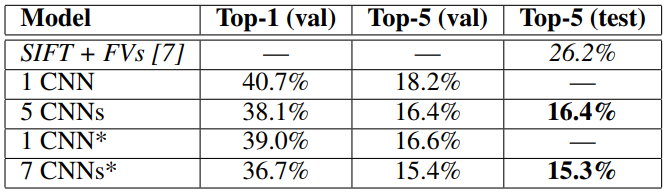

# ImageNet Classification with Deep Convolutional Neural Networks

[원 논문 : ImageNet Classification with Deep Convolutional Neural Networks](https://papers.nips.cc/paper/4824-imagenet-classification-with-deep-convolutional-neural-networks.pdf)

### Introduction
현재 좋은 성능을 내는 이미지 분류 모델들의 특징은, 머신 러닝 방법론을 사용한다는 점입니다. 머신 러닝 기반 분류 모델의 성능을 높이기 위해서는, 큰 데이터셋과 파워풀한 모델, 그리고 모델의 Overfitting을 방지하기 위한 여러 방법들이 필요합니다. 지금까지 MNIST나 CIFAR-10/100과 같은 작은 데이터셋들에 대해 분류 모델을 학습할 때는 CNN과 같은 여러 Deep learning Approach들이 좋은 결과를 보였으나, 현실 세계의 문제에 이를 적용하기에는 턱없이 부족했습니다. 주요한 이유는 역시 작은 데이터셋이었고, 논문에서는 이를 해결하기 위해 거대한 이미지-레이블 데이터셋인 LabelMe와 ImageNet을 이용해 분류 모델 __AlexNet__ 을 학습하기로 합니다. 또한 거대한 크기의 데이터셋을 효율적으로 학습하고, Overfitting을 방지하기 위해 도입한 다양한 기법들에 대해 소개합니다.

ImageNet 데이터셋은 이때까지의 데이터셋보다 비교적 고해상도의 이미지들을 가지고 있습니다. 고해상도의 수많은 이미지 데이터들을 CNN 구조로 학습하려면, 매우 큰 컴퓨팅 자원이 필요합니다. 논문에서는 여러 대의 GPU를 활용하여 병렬 연산으로써 네트워크를 학습시킬 수 있게 된 것이 중요한 전환점이라고 말했습니다. 지금은 어쩌면 당연해진 이 방식을 왜 자랑하듯이 써 놓았는지 확인해 보았더니, 제 1저자인 [Alex Krizhevsky](https://www.cs.toronto.edu/~kriz/)가 CUDA 라이브러리를 작성한 사람이었습니다. 말그대로 현재의 GPU 병렬 연산 아키텍처를 이 논문의 저자가 개발한 것입니다. 이렇게 개발된 GPU 병렬 컴퓨팅을 활용하면, CNN 학습에서 가장 중요한 부분인 2D Convolution 연산을 매우 빠르게 수행할 수 있습니다. 따라서 큰 스케일의 CNN 네트워크를 빠르게 학습 가능하게 됩니다.

이 논문에서는 이외에도 거대한 데이터셋을 사용한 분류 모델을 학습하기 위한 다양한 기법들을 소개하고 있습니다.

### The Dataset
논문에서는 먼저, 모델을 학습하기 위해 사용되는 ImageNet 데이터셋에 대해 설명했습니다. ImageNet은 22,000개의 카테고리로 분류된 1500만 장 이상의 고해상도 이미지가 포함된 데이터셋입니다. 이미지는 모두 웹에서 모아졌으며, Amazon의 크라우드소싱 툴인 Mechanical Turk를 이용하여 사람의 힘으로 레이블링되었습니다. 데이터셋이 사용되기 시작한 건 __PASCAL Visual Object Challenge (Pascal VOC)__ 라는 이미지 인식/검출 대회의 한 부분으로 진행된 __ImageNet Large-Scale Visual Recognition Challenge (ILSVRC)__ 의 2010년 대회에서 처음 사용되었습니다. ILSVRC 대회에서는 ImageNet 데이터셋에서 1000개의 카테고리만을 가지게 추출된 데이터 셋을 사용합니다. 이 세트에는 약 120만장의 Training 이미지, 5만장의 Validation 이미지, 15만장의 Testing 이미지가 포함되어 있습니다. 2010년 대회의 데이터셋이 유일하게 공개된 데이터셋으로, 이 논문에서는 이를 사용하였습니다.

웹에서 가져온 이미지들은 제각각 다양한 해상도를 가지고 있습니다. CNN 네트워크의 입력 이미지 크기는 고정되어야 하므로, 다양한 입력 이미지들의 크기를 모두 256 x 256 사이즈로 바꾸어주는 작업을 진행하였습니다. 이미지의 가로와 세로 중 짧은 부분을 256 픽셀 사이즈로 줄인 후, 긴 부분의 가운데 256픽셀 길이를 추출(Cropping)하여 학습을 위한 크기로 변경합니다. 학습은 이미지의 RGB raw value들을 이용해 진행합니다.

그리고, ImageNet 데이터셋을 이용해 학습시킨 분류 모델의 성능을 파악하기 위한 지표 중 하나인 __Top-5, Top-1 Error Rate__ 에 대해 알아보겠습니다. 먼저 __Top-5 Error Rate__ 는, 정답 레이블 클래스가 모델이 가장 높은 확률을 준 상위 5개의 클래스 안에 포함되어 있지 않았던 비율을 말하고, __Top-1 Error Rate__ 는 상위 1개의 클래스 안에 포함되어 있지 않았던 비율을 얘기합니다.

### The Architecture
이 섹션에서는, 네트워크를 학습시키기 위한 다양한 기법과 네트워크 구조에 대해 설명합니다.

#### ReLU Nonlinearity
보통 사용했던 뉴런의 Activation Function은 Sigmoid (  ), 또는 tanh (  )였습니다. 논문에서는 새로운 Nonlinearity Function인 ReLU (  )를 제안합니다. 이 함수가 다른 Activation들보다 Gradient Descent를 통한 학습이 빠르다고 합니다. 다음과 같은 그림으로 차이를 보여주고 있습니다. (손으로 그린 티가 확 나긴 하지만...)

#### Training on Multiple GPUs
두 번째는, 이 논문의 핵심인 여러 대의 GPU를 이용한 학습입니다. 논문에서 네트워크를 학습시킬 때에, GTX 580 GPU를 사용했다고 합니다. 하지만 3GB의 메모리를 가진 이 GPU 한대만으로는 큰 모델을 학습하기에 무리가 있었고, 그래서 두 대를 동시에 사용하였습니다. 지금의 GPU는 GPU간의 데이터 교환을 통한 병렬 연산에 매우 최적화되어 있습니다. 논문에서 네트워크를 구현할 때, 두 개의 GPU에 네트워크의 Parameter들을 나누어 학습했다고 합니다. 이런 모양이 가능한 이유는, GPU가 따로 Host Machine의 힘을 빌릴 필요가 없이 다른 GPU의 메모리에 접근할 수 있기 때문입니다. 논문에서는 네트워크 구조 중 일부 Convolution Layer에 이를 적용하고 있습니다. 확실히 모델의 학습 속도가 크게 빨라졌다고 합니다.

#### Local Response Normalization
__Lateral Inhibition__ 이라는 현상이 있습니다. 생물학적 뉴런들의 네트워크에서, 강한 자극을 받는 뉴런이 약한 자극을 받는 뉴런의 신호 전달을 억제하는 현상을 말합니다. 예를 들어 다음 그림을 보면,

중간중간 흰 선의 교차점이 약간 검은 색으로 변해 보이는 것을 느낄 수 있습니다. 이것이 우리의 시각 세포끼리 Lateral Inhibition을 일으킨 결과입니다. 검은 색에 반응하는 뉴런들이 상대적으로 강한 자극을 받아, 약한 자극을 통해 뇌에 흰색을 인식시키는 뉴런들의 신호 전달을 억제했기 때문입니다.

논문에서는 ReLU Activation으로 인해 Convolution Layer에서도 이와 같은 문제가 발생한다고 주장합니다. ReLU의 특성상 Activation Function을 거친 이후 큰 값이 출현할 수 있는데, 이것이 주변 뉴런에 비슷한 영향을 미친다고 합니다. 또한 ReLU는 __Unbounded__ 된 Activation입니다. 다시 말해, 0 이상의 입력을 그대로 출력하기 때문에 Activation의 한계치가 없습니다. 이를 정규화하기 위해 __Local Response Normalization__ 을 제안합니다.

논문의 수식이 아닌 그림으로 알아보겠습니다. 원리는 생각보다 간단합니다. 아래의 그림은 LRN의 과정을 묘사합니다.

[출처](https://www.quora.com/What-is-local-response-normalization)

기본적인 아이디어는, 하나의 Receptive Field에서의 Activation 출력을 그 Field 주변의 Convolution Kernel들(__Adjacent Kernels__)을 이용해 정규화하자는 것입니다. 입력 Feature Map에서 하나의 Receptive Field에 대한 Convolution을 진행할 때, Normalize를 위한 Spatial Convolution들을 따로 진행합니다. 이는 하나의 Kernel만 가지고 수행하는 것이 아니라, 인접한(Adjacent) 여러 Kernel들에 대해 모두 수행하는 Convolution 연산을 의미합니다. 각각 Convolution을 수행하고 ReLU Activation을 거친 뒤, 그 출력의 제곱을 모두 더해서 그 위치의 원래 Convolution 출력에 나눠주어 Normalization합니다. 논문에서는 수식으로 아래와 같이 표현했습니다.

은 Spatial Convolution을 수행할 인접한(Adjacent) Kernel의 개수이고, 은 레이어 내 총 커널의 개수입니다. 는 모두 Hyper-Parameter이고, Validation Set을 이용하여 튜닝한 결과 을 사용하는게 좋다고 결과를 내렸다고 합니다.

이 기법을 사용하면 사용하지 않았을 때와 비교해 Top-5와 Top-1 Error Rate가 각각 1.4%, 1.2% 감소했다고 합니다. 또한 CIFAR-10 기반으로 학습된 분류 모델의 에러율이 13%에서 11%로 감소하는 결과를 얻었습니다.

#### Overlapping Pooling
이 기법은 말그대로 아래 사진과 같이 겹쳐서 풀링하는 방법입니다.

Pooling을 Stride , Kernel size 로 수행할 때, 이면 일반 Pooling입니다. Overlapping Pooling은 인 경우입니다. 논문에서는 을 적용하였고, 일 때와 비교했을 때 Top-5와 Top-1 Error Rate가 각각 0.4%, 0.3% 감소했다고 합니다.

#### Overall Architecture
위의 방법들이 적용된 모델의 구조는 총 8개의 레이어로 이루어져 있습니다. 5개의 Convolutional Layer와 3개의 Fully-Connected Layer를 거쳐, 1000 길이의 Vector 출력에 SOFTMAX를 먹여 분류를 수행합니다. 두번째, 네번째와 다섯번째 Convolution Layer에 위에서 설명한 GPU 병렬 기법을 적용합니다. LRN은 첫번째와 두번째 레이어에 적용됩니다. 모든 레이어의 Activation Function은 ReLU가 사용됩니다.

AlexNet의 구조를 나타낸 그림입니다.

입력 이미지는 224 x 224 크기 3 채널 RGB 이미지입니다.

### Reducing Overfitting
논문에서 제안한 AlexNet은 6000만개의 Parameter를 가지고 있습니다. 많은 Parameter를 가진 만큼, Overfitting의 가능성도 큽니다. 이 논문에서는 Overfitting을 줄이기 위한 방법들 또한 제한합니다.

#### Data Augmentation
Overfitting을 줄이기 위한 대표적인 방법 중 하나는 이미지 데이터를 레이블을 유지하면서 변형하는 것입니다. 논문에서는, 데이터셋 내 이미지를 약간의 Python 코드를 사용해 Augmentation하여 학습에 활용합니다. 이에는 두 가지 방법이 사용됩니다.

첫번째 방법은, Patch의 추출과 Horizontal Reflection입니다. Patch의 추출은 256 x 256 크기 이미지에서 224 x 224 크기만 추출하여 사용하는 것이고, Horizontal Reflection은 말그대로 이미지를 수평으로 반전시키는 것입니다. 아래와 같이 말이죠.

네트워크에 입력으로 들어갈 이미지에 대해서 총 5개의 Patch를 추출하고(좌상단, 우상단, 좌하단, 우하단, 중앙), 각각 Horizontal Reflection을 적용하여, 이미지 한 장을 아래와 같이 열 장으로 만들어냅니다. 이 10개를 모델에 입력한 후, 총 10개의 Softmax 출력을 평균내어 최종 예측 결과를 내놓게 됩니다.

두 번째 방법은, 이미지의 RGB 강도를 달리하는 것입니다. 이는 이미지에 PCA를 실행하여 이루어집니다. 이미지에 PCA를 실행해서 찾아낸 주성분의 배수를, 해당 고유값(Eigenvalue)에 비례하는 크기와 평균이 0이고 표준 편차가 0.1인 Gaussian Distribution으로부터 추출한 무작위 값에 곱합니다. 이 기법을 적용하는 과정에서 하나 얻을 수 있는 사실은, 이미지를 분류하는 데에 중요한 역할을 하는 특징들은 색상의 변화에 민감하지 않다는 것입니다. 따라서 이와 같은 방법으로 이미지 데이터를 Augmentation할 수 있습니다. 이 방법을 사용해 Top-1 Error Rate를 1% 줄였습니다.

#### Dropout
Dropout은, 출력 뉴런의 일정 비율만 Activation을 남겨 놓고, 나머지는 다 0으로 만들어주는 기법입니다. 논문에서는 50%만 살려놓았습니다. Activation이 사라진 뉴런들은 순전파와 역전파 과정에서 영향을 주고받지 않습니다. 활성화되는 뉴런의 수를 줄임으로써, 뉴런끼리 주고받는 상호작용을 줄여 Overfitting의 가능성을 감소시킵니다.

Dropout은 처음 두 개의 Fully-Connected Layer에만 적용합니다. Dropout이 없으면 Overfitting을 보이지만, 적용한 후에는 수렴하기 위해 필요한 학습이 두 배가 된다는 문제가 있습니다.

### Results & Conclusions

첫번째 테이블은 지금까지의 고전적인 방법들과 비교한 모델의 성능 측정이고, 두 번째 테이블은 CNN 모델간의 비교 결과입니다. 확실히 고전적인 방법에 비해 큰 성능 개선을 보여주는 것을 볼 수 있었습니다.

성능 향상 말고도, 논문의 저자들이 확인한 중요한 사실 하나가 더 있습니다. 네트워크의 전체 모델 파라미터 개수의 1%도 차지하지 않는 __작은 Convolution Layer 하나만 제거__ 해도, 네트워크가 __훨씬 나쁜 성능__ 을 보인다는 사실을 확인하였다고 합니다.
