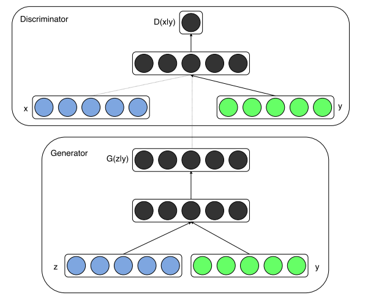
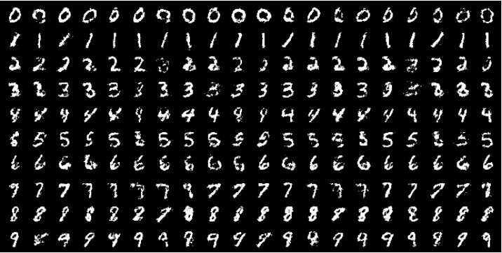

# CGAN

### Introdution
기존 GAN은 분포 내에서 이미지를 랜덤하게밖에 생성할 수 없는 문제점이 있었다. 따라서 이를 활용하기에는 많은 제약이 따랐는데, CGAN은 이를 타개하고 Conditional한 이미지 생성을 추구하는 모델이다. 논문에서는 Multi-modal Learning을 위함이라고 하고 있다. 사실상 Conditional한 생성과 비슷한 말이라고 보면 될 듯 하다.

### Model Structure
원본 데이터의 분포 , 랜덤 노이즈의 분포 , 생성 함수  와 판별 함수 가 정의될 때, Minimax Game으로 명명되는 GAN의 목적 함수는 다음과 같다.

Generator는 입력 노이즈 를 받아서 최대한 실제 이미지와 구별되지 않게 생성해내면 이 목적함수의 최소화를 이뤄낼 수 있고, Discriminator는 입력으로 이미지를 받아서 최대한 가짜 이미지를 구별해내면 목적 함수를 최대화할 수 있게 설계되어 있다.

CGAN은 여기서 크게 벗어나지 않는다. 그저 Genertor와 Discriminator를 학습하는 과정에서 __Extra information__ 를 주는 것 뿐이다. 이 정보에는 Generator가 이미지를 어떻게 생성했으면 하는지에 대한 부가적인 정보가 담겨 있다. Generator는 입력 노이즈  뿐만 아니라  에도 영향을 받아 이미지를 생성하기 때문에, 학습이의 조정으로 Generator의 이미지 생성을 유도할 여지가 많아지는 것이다.

가 추가된 CGAN의 목적 함수는 다음과 같다. GAN의 목적 함수를 에 Conditional하게 바꾼 모습이다.

Generator는 이미지를 생성할 때 에 Conditional하게  노이즈를 선택하며, Discriminator 의 판별 또한 입력 이미지와 를 함께 고려해서 진행된다.

논문에는 다음과 같은 그림으로 구조를 소개하고 있다.

실제 이 모델을 구현할 때는, 보통 와   벡터를 단순히 Concatenation하는 방식으로 진행된다.

### Experiments

논문에서 진행한 실험은, 를 MNIST의 10개의 클래스를 결정하는 요소로 두고 그에 맞는 숫자 사진을 Generator가 생성하는지 보는 것이다. 결과는 아래와 같이 잘 됨을 볼 수 있었다.

