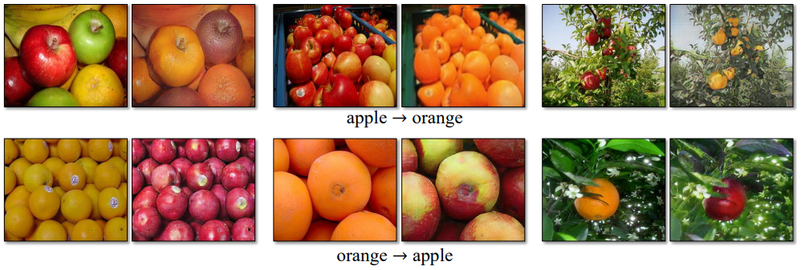

# CycleGAN

### Introduction

좌상단의 그림은 클로드 모네의 작품 [Argenteuil, The Seine](https://www.wikiart.org/en/claude-monet/argenteuil-the-seine)이고, 그 옆은 똑같은 풍경을 사진으로 옮긴 것이다. 아래는 그 반대의 경우이다. 모네의 그림과 정확히 똑같은 풍경을 가진 사진을 찍는 것이 가능할까? 또, 어떤 사진과 완벽히 같은 풍경을 그리고 있는 모네의 그림을 찾는 것이 가능할까? 불가능하다. 위의 사진은 이 논문에서 제안하는 CycleGAN 네트워크가 만들어낸 사진이다. CycleGAN은 이를 가능케 한다.

기존에도 이미지를 입력으로 받아 Translation을 수행하는 네트워크는 있었다. 대표적으로 [pix2pix](https://arxiv.org/abs/1611.07004) 모델이 있는데, 이는 아래의 사진에서 'Paired' 부분과 같은 Translation을 할 수 있었다.

이 논문에서 제기한 문제점은, 많은 경우에 pix2pix를 적용할 수 있는 데이터와 같은 __Paired__ 한 데이터를 얻기 힘들다는 것이다. 최소한 두 도메인 간에 관계성이라도 있어야 하는데, 그렇지 못한 경우가 많다. 아래의 사진을 보자.

들판 위에 여러 꽃이 예쁘게 핀 사진이 있고, 그 옆에는 완벽히 같은 풍경에 각 화가의 스타일을 입힌 작품들이 있다. Style transfer를 위해 원래 사진과 비슷한 모네, 반 고흐의 사진을 찾을 수 있을까? 반 고흐를 다시 살려내지 않는 이상 불가능하다. CycleGAN에서는 이와 같이 전혀 상관없는 두 이미지 데이터들, 즉 __Unpaired__ 한 이미지 세트들 간의 Translation에 초점을 맞추고 있다.

예를 들어 아래와 같은 결과를 원하는 것이다. 완벽히 같은 장소에서 완벽히 같은 포즈로 있는 두 마리의 말과 얼룩말들을 캐치할 수는 없다.

### Concept

서로 Unpaired한 두 이미지 도메인 와 가 있다. 논문에서는 두 Mapping을 학습하려고 한다.

매핑 는 X 도메인의 이미지를 입력으로 받아 그에 대응하는 Y 도메인의 이미지를 생성한다. 인 이미지 에 대해서 인 를 생성했을 때, 이를  인 와 구별하기 힘들게 가 학습된다. 일반적인 GAN의 모습이다.

CycleGAN은 그 역을 학습하는 또 다른 Generator  또한 만들었다. 는  도메인 내의 이미지 를 입력으로 받아  도메인의 이미지를 생성해낸다.

위의 두 매핑 함수를 학습했을 때, 최상의 상태는 인 상태이다. 두 도메인 사이의 매핑 함수를 완벽히 학습했다는 말이 되기 때문이다. 그리고 이 때, 둘 중 하나의 Generator만을 사용해 이미지를 생성하게 되면, 서로 다른 도메인 간의 완벽한 Image to Image Translation이 이루어진다는 것이 논문의 Concept이다.

이 논문에서는 위의 아이디어를 구현하기 위한 특별한 Loss 함수를 제안한다.

### Loss like Cycle

#### CycleGAN Objective Function

CycleGAN은 아래의 사진과 같은 구조를 가지고 있다.

서로 다른 두 이미지 도메인 에 대해서, 위에서 말했던 두 Generator 가 정의된다. 이 때, 는 입력된 이미지가 가 만들어낸 이미지인지  도메인에 실재로 존재하는 이미지인지 구별한다.  또한 입력 이미지가 가 만들어낸 이미지인지, 아니면  도메인에 존재하는 이미지인지 알아낸다. 와 는 두 Discriminator를 속이기 위해서, 두 도메인간의 이미지 변환을 더 잘 하려고 노력할 것이다. CycleGAN은 이렇게 학습된다.

이를 GAN의 목적 함수 모양으로 보면 다음과 같다.

식을 보면 알 수 있겠지만, 는 이 함숫값을 크게 만들수록 를 잘 속이는 방향으로 이미지를 잘 생성할 것이고, 는 이 함숫값을 작게 만들수록 실제 도메인에 존재하는 이미지와 가 생성한 이미지를 잘 구별하는 방향으로 학습될 것이다. 따라서 학습 시 다음과 같이 트레이닝된다.

역방향으로 이미지를 만드는 와 그를 구별하는 에 대해서도 같은 모양으로 목적 함수를 트레이닝해줘야 한다.

#### Cycle Consistency Loss

그런데 위처럼 두 목적 함수만 트레이닝한다고 Translation이 되지는 않는다. 위에서 보았듯이 와 는 그저 반대편의 Discriminator를 속이기 위해서만 학습한다. 논문에서는 이렇게 될 경우, 어떤 입력을 Generator에 넣어도 작은 양의 비슷한 이미지들만 매핑하려고 한다는 네트워크의 문제점을 밝히고 있다. 사람 눈에는 Translation이 전혀 되지 않는 것처럼 보여도 Discriminator가 구분하지 못하면 네트워크 입장에서 이미지를 잘 생성했다고 판단한다는 것이다.

이 문제점을 해결하고 Image 간의 Translation을 제대로 수행하기 위해서, 논문에서는 __Cycle Consistency Loss__ 를 도입했다. 이 Loss는, 두 개의 매핑 함수를 거쳐 돌아오면서 생성된 이미지가 처음 입력으로 들어갔던 이미지와 최대한 비슷해지게 만드는 역할을 한다. 즉,  도메인의 입력 가 매핑 함수 를 타고  도메인으로 Translation되었다가, 그것을 입력으로 다시  함수가 이미지를 생성해서 를 만들어내면, 가 될 때 완벽한 Image Translation이 이루어진다는 얘기이다. Cycle Consistency Loss는 와 의 차이가 최대한 줄어들도록 만든다. 물론 역방향의 Loss도 존재한다. 가 되게 만드는 함수가 그것이다.

둘 간의 차이를 줄일 때는 L1 Loss를 사용한다. 따라서 Loss 함수는 다음과 같이 정의된다.

이 Loss의 구조를 그림으로 보면 다음과 같다.

입력 와, 가 두 매핑 함수를 거쳐서 생성된 , 즉 의 차이를 비교하고 있다. 그 반대도 동일하게 수행된다. 이것이 __Cycle Consistency Loss__ 이다.

#### Loss

결론적으로, CycleGAN의 최종적인 Loss 함수는 아래와 같은 모습이다.

두 도메인에 대한 GAN Loss에 Cycle Loss를 같이 사용했다.

또한 두개의 GAN Loss에 대해서는 다음과 같이 트레이닝된다. 에 대해서, 는 를 최소화하는 쪽으로 트레이닝되며, 는 를 최소화하는 방향으로 트레이닝된다.

### Result

결과는 대단하다. 그림을 사진으로 바꾸고 사진을 그림으로 바꾸고, 여름을 겨울로 바꾸고 오렌지를 사과로 바꾸고 얼룩말을 말로 바꾸고... 별걸 다 한다.

