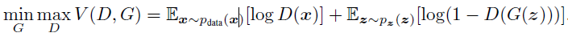
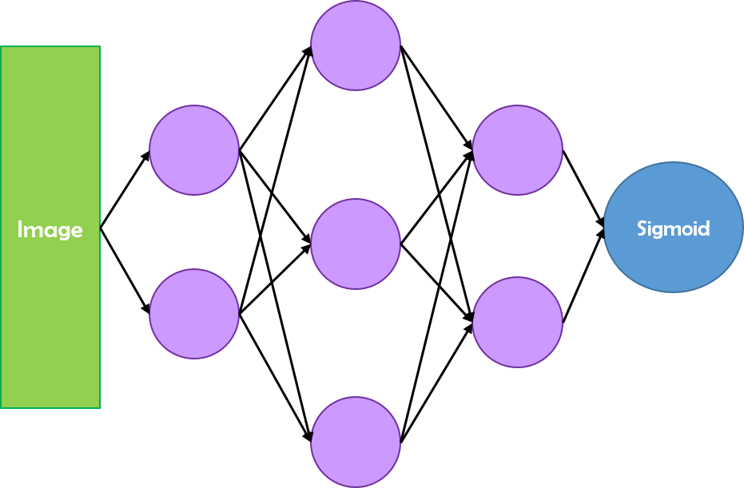
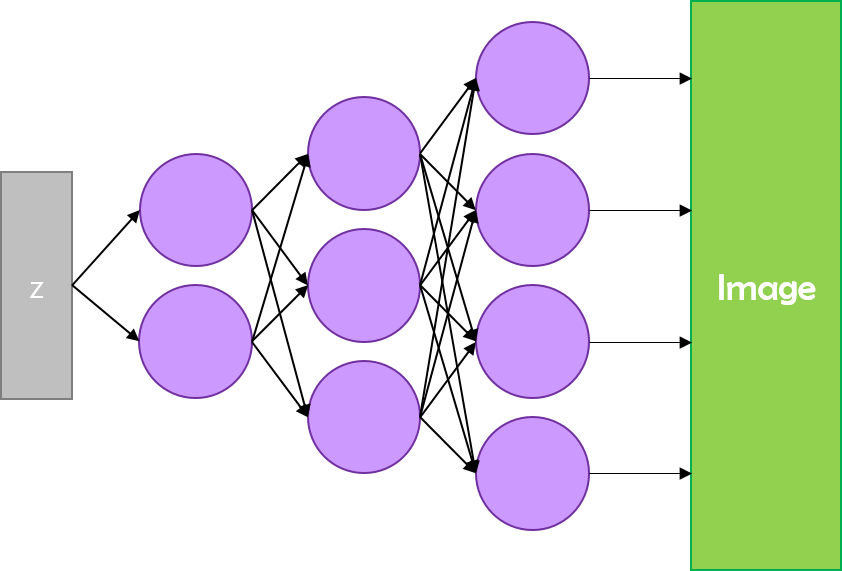
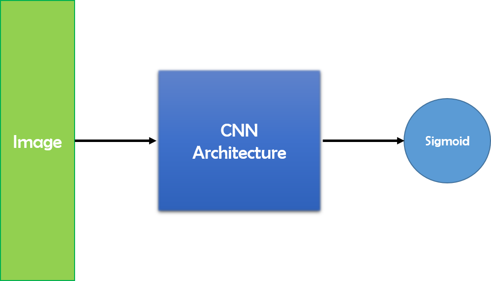
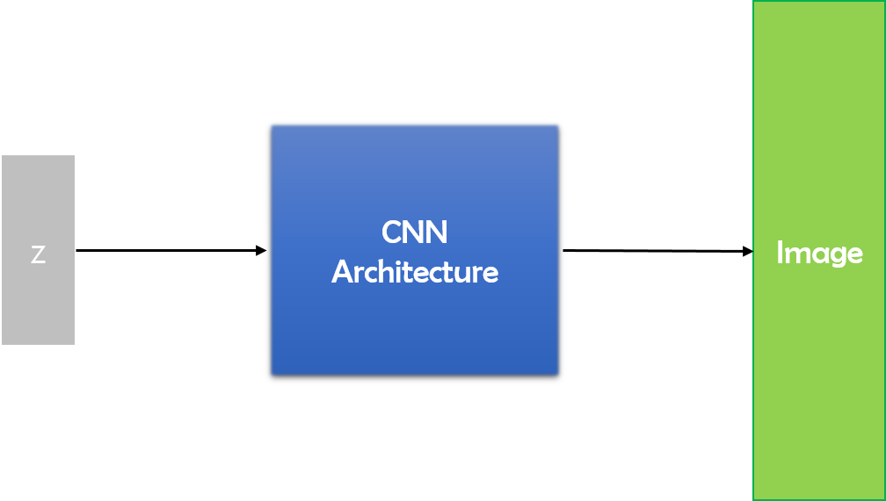
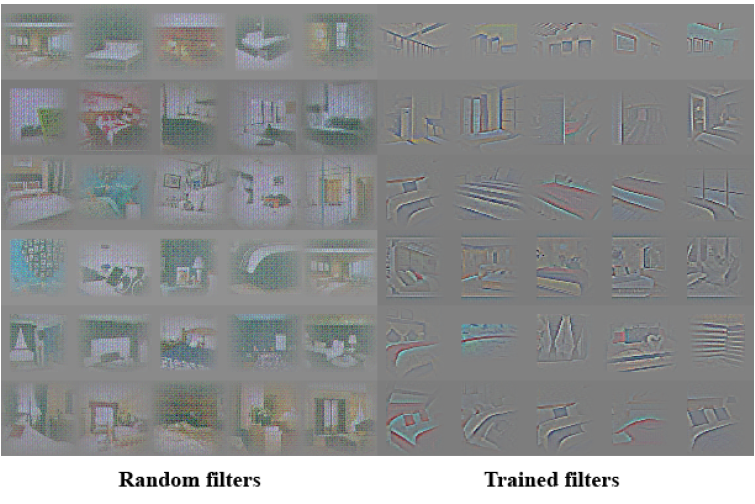
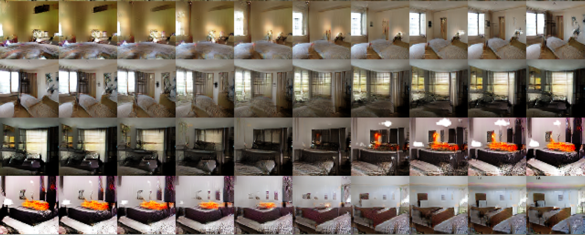
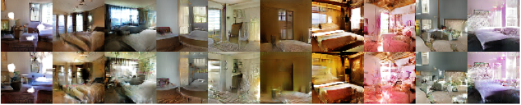
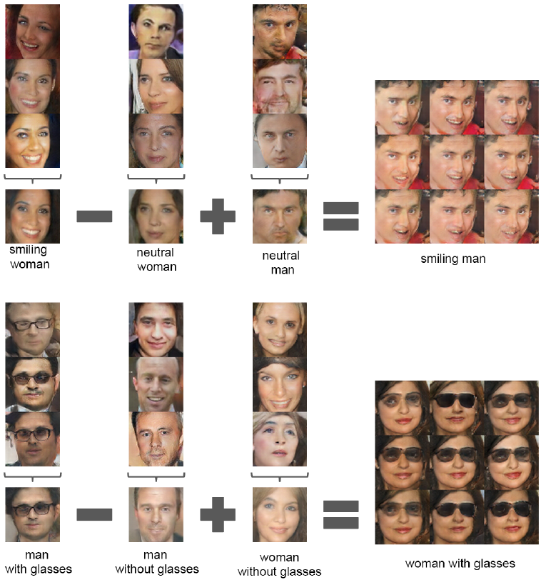

# DCGAN (Deep Convolutional GAN)

GAN이 나온 이후로, 전통적인 GAN의 여러 문제점들이 발견되었습니다.

가장 먼저 보이던 문제점은, (비교적) 고해상도의 이미지를 생성하기 힘들다는 점이었습니다. 또 다른 문제점은, GAN의 구조 자체가 불안정(unstable)하다는 것이었습니다. 이는 Minimax 문제를 푸는 네트워크인 특성상 어쩔 수 없는 문제였다고 합니다. 네트워크의 구조가 Fully-Connected했던 것도 두 문제점의 이유들 중 하나였습니다.

이후 다양한 논문들이 이 문제점을 해결하기 위해서 많은 노력을 했습니다. 여러 해상도로 본 이미지의 정보들을 모아 더 나은 이미지를 생성하는 모델인 LAPGAN 등이 제안되었지만, 위의 문제를 아직 잘 해결하지는 못했습니다. 이런 상황에서 2016년에 제안된 __Deep Convolutional Generative Neural Networks__, 즉 __DCGAN__ 이 엄청난 성능을 보여주었습니다. 이후 나온 거의 모든 GAN 논문들은 DCGAN의 구조를 따라해도 과언이 아닐 정도로, Unsupervised Learning계에 큰 폭풍을 몰고 온 모델입니다.

이 논문에서 보여주고자 한 것은 여러가지입니다. 논문에서는 정말 다양하면서 신기한 실험들을 하는데, 모두 DCGAN을 구현함으로써 도출해낸 결과물입니다. 하나하나 정리하자면 다음과 같습니다.
1. 장면(Scene)을 이해하고 기존 GAN보다 더욱 고해상도의 세밀한 이미지를 생성
2. GAN의 불안정함을 없애고 대부분의 상황에서 안정적으로(stable) 학습이 되는 GAN 모델을 제안
3. DCGAN 내의 특정 Convolution 필터가 특정 물체를 인식하고 반응하고 있음을 확인
4. Generator가 이미지를 외워서 출력하는 것이 아니라는 것을 확인
5. Generator의 입력으로 들어가는 Input noise에 대한 벡터 산술 연산으로 출력 결과를 조정할 수 있음을 확인

### 모델의 구조
논문에 특별히 수식은 없었습니다. 대부분의 구조적 기본은 GAN 논문에 나온 그대로이기 때문입니다. 학습 과정도 동일합니다. GAN의 목적 함수를 DCGAN의 Generator와 Discriminator도 동일하게 사용합니다.

Discriminator는 이를 최대화하고, Generator는 이를 최소화하는 방향으로 학습을 진행합니다.

DCGAN이 원래의 GAN과 다른 점은 이름에서도 볼 수 있습니다. 한마디로 __Deep Convolutional__ 한 네트워크를 만들어낸 것입니다. 그를 위해서 GAN의 모든 Fully-Connected Layer들을 Convolution Layer로 대체했습니다.

기존 GAN의 형태입니다. Discriminator도 Fully-Connected로 구현되어 있고,

Generator도 그렇습니다.

하지만 DCGAN은 중간의 완전 연결을 CNN으로 대체했습니다. 다음 그림과 같이 말이죠.

여기서 Discriminator는 일반 CNN 구조에서 사용되는 Strided Convolution입니다. CNN 구조에서 특징을 추출하고 분류하는 부분을 담당합니다. Generator는 __Fractional Strided Convolution__ 을 사용합니다. Stride가 분수 형태라는 의미로, Upsampling하는 방법 중 하나입니다. Deconvolution이라고 부르기도 하는데, 이는 사실 잘못된 말이라고 합니다. 같은 방법이 FCN에도 사용되었습니다. Deconvolution이라는 단어의 정확한 정의와 구현을 찾아봐야겠습니다.

Discriminator는 Convolution을 거치면서 입력 이미지의 특징을 뽑아낸 후에, 특징 맵의 크기를 점점 줄이면서 마지막에는 한 개의 값으로 축소시킵니다. 그리고 그 값을 Sigmoid 활성화 함수에 넣어서, Discriminator의 예측인 D(x) 값을 구합니다.

Generator의 필터는 원본 이미지의 특징을 복원할 수 있도록 학습됩니다. GAN에서 D(G(z))가 1이 되어야 하기 때문에, Loss에 따라 학습되는 Generator의 Convolution Layer들은 그렇게 학습될 수 밖에 없습니다. Generator는 입력 노이즈 z를 받아서 z의 분포 위치에 대응하는 이미지를 생성합니다. 그리고 Generator의 Fractional Strided Convolution Layer의 필터들은 특징적인 사물을 기억해서 재현하도록 학습됩니다. 따라서 z에 따라 생성 이미지에 영향을 미치는 필터가 달라집니다.

### 결과

#### GAN to Feature Extractor
먼저 __GAN을 Feature Extractor로 사용하는 실험__ 을 저자들이 진행했습니다. Discriminator는 입력 이미지의 특징을 파악할 수 있도록 필터가 학습됩니다. Discriminator가 얼마나 이 특징을 잘 학습했는지 알아보는 대표적인 방법 중 하나는, 이 필터들을 이용해 Supervised Learning한 결과를 보는 것입니다.

논문의 저자들은 CIFAR-10 데이터셋에 대해 실험을 진행했습니다. 먼저 DCGAN을 Imagenet-1K 데이터셋으로 학습시켰습니다. 그 후 Discriminator의 Convolutional Feature들을 이용해서 모든 레이어에 대해 4 x 4 그리드의 맵을 생성합니다. 이 과정에서 각 Feature Map에 대한 Max pooling을 이용합니다. 그리고 그것들을 1차원으로 펴면, 28672차원의 벡터가 나오게 됩니다. 그리고 그 벡터들을 이용해 L2-SVM으로 트레이닝해서, 이미지 분류를 시행합니다. 이는 82.8%의 정확도를 보였습니다. 정통 CNN으로 분류한 성능과 비교해도 크게 뒤지지 않는 성능을 보여주었습니다.

다음으로, 저자들은 Discriminator의 필터들이 실제로 이미지에서 특정 사물에 반응하고 있다는 것을 보여주는 실험을 진행했습니다. DCGAN의 트레이닝이 완료된 후 필터들을 실제 출력해본 결과입니다.

#### Generator의 특징 학습
다음으로, Generator가 이미지를 외워서 만드는 것이 아니라, Generator의 필터가 실제로 이미지 내의 특징들을 알고 있다는 것을 증명하기 위한 실험들을 몇 가지 진행했습니다. 첫 번째로 저자들이 __Walking in the latent space__ 라고 부르는 실험입니다. Generator의 z값이 서서히 변화할 때, 출력이 갑작스럽게 바뀌듯이 표현된다면(Sharp Transition) Generator가 학습 이미지를 '외웠다'고 볼 수 있을 겁니다. 그래서 저자들은 두 개의 z값을 뽑은 뒤에, 그 사이에 9번의 Interpolation을 수행해서 서서히 변해가는 z 입력에 따라서 Generator가 만드는 이미지가 어떻게 달라지는 지 확인했습니다.

특히 첫 번째 줄의 경우, 창문이 없던 침실이 서서히 커다란 창문을 가진 침실로 변해가는 모습을 볼 수 있습니다. 여기서 저자들은 맨 앞 사진을 생성하게 만드는 z를 뽑고, 맨 뒤 사진을 생성하게 만드는 z를 뽑아 사이를 Interpolation한 것입니다. 서서히 변함을 보여주면서, 실제로 Generator가 '창문'과 같은 특징을 학습했음을 보여주었습니다.

다음 실험은, __네트워크가 특정 사물에 대한 특징을 잊어버리도록 만들어보는 것__ 입니다. Generator에서 창문을 기억하고 있는 필터의 내용을 0으로 다 지워버린 후 창문이 있는 방의 이미지를 생성하라고 해 보았습니다.

놀랍게도, 네트워크는 창문이라는 물체를 잊어버리고 창문이 있어야 하는 자리에 다른 물체를 우겨넣으려고 한 흔적이 보입니다. 이 실험을 통해서 DCGAN의 Generator 내의 각 필터는 특정한 물체에 대한 특징을 기억하고 있고, 그것을 바탕으로 이미지를 생성한다는 것을 단적으로 볼 수 있었습니다.

마지막으로 __z 벡터의 산술 연산__ 입니다. 이 논문에서 개인적으로 가장 신기했던 부분이기도 합니다.

Generator의 입력 노이즈 z에 대한 산술 벡터 연산을 시행하면, Generator의 CNN 구조 자체가 z가 x 데이터에 대해 매핑하는 이미지를 생성하도록 학습했기 때문에, Generator가 z에 맞는 이미지를 생성해 냅니다. 만약 어떤 노이즈 z가 어떤 x에 대해 매핑될 때 그 x가 '안경 쓴 여자' 라면, 그 z를 입력으로 받은 Generator는 '안경 쓴 여자' 이미지를 만들겁니다.

입력 노이즈 z에 대한 산술 연산을 시행하면, Generator가 최대한 그 z와 매핑되는 이미지를 생성하려고 노력합니다. 그 과정에서 중간중간의 Convolutional 필터들이 학습 이미지의 특징적인 부분들을 기억하기 때문에, 아래 그림과 같은 이미지에 대한 벡터 산술 연산이 가능하게 됩니다.

'웃는 여자' 이미지를 생성하게 만드는 z에서 '여자'라는 특징을 생성하는 z를 빼고, 거기에 '남자'라는 특징을 생성하는 z를 더하면 '웃는 남자' 이미지가 생성됩니다. 이는 입력 z에 따라서 Generator 내부에서 반응하는 필터들이 달라지기 때문입니다. 마찬가지로 '안경 쓴 남자'를 생성하는 z에서 '안경 벗은 남자'를 생성하는 z를 빼고 '안경 벗은 여자'를 생성하는 z를 더하면, '안경 쓴 여자' 이미지가 생성됩니다.
