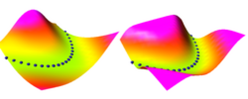
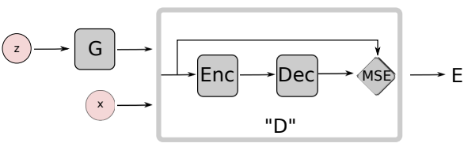
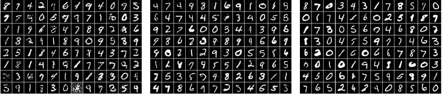

# EBGAN

### Introduction
__Energy-based Model__ 이라는 모델 구조가 있습니다. 어떤 데이터 셋 내의 모든 데이터 Point들에 대해서, 에너지의 Manifold가 존재합니다. 기본적으로 학습의 결과로 찾고자 하는 데이터의 Manifold 상 모습과 데이터 샘플이 비슷할 때 에너지는 낮아집니다. 지도 학습은 어떤 데이터 에 대한 Label 를 알맞게 찾아내는 것이 목적입니다. 가 알맞은 Label일 때 에너지는 낮아지며, 틀린 Label일 때 에너지는 높아집니다. 비지도 학습에서는 원본 이미지의 데이터 분포를 얼마나 비슷하게 따라가는지에 따라 에너지가 부여됩니다. 특히 GAN 모델에서는, Generator가 생성한 샘플이 원본 데이터의 분포상에서 높은 밀도를 가지는 부분에 매핑되는 샘플일수록 에너지가 낮아지고, 낮은 밀도를 가지는 부분의 샘플일수록 에너지가 커집니다.

이 논문은 기존 GAN의 Discriminator가 확률적으로 샘플을 해석하던 특징에서 벗어나고자 합니다. Discriminator는 데이터에 분포에 따라 Generator가 생성한 샘플에 알맞은 Energy를 계산합니다. Generator는 이 에너지를 보고 트레이닝하게 됩니다.

먼저 Energy-based Model에 대해 알아보고 가겠습니다. __Energy__ 는, 입력 공간의 각 점들의 하나의 Scalar로의 매핑입니다. 에너지 기반 모델은 입력 공간에 따른 적절한 에너지의 생성을 이루어내는 함수를 학습하는 모델입니다. 모델이 학습의 결과로 예상되는 것과 비슷한 출력을 낼 수록 에너지는 낮아지며, 다르게 이상한 출력을 낼 수록 에너지는 높아집니다. 지도 학습(Supervised Learning)의 관점에서 보면, 트레이닝 데이터 세트의 샘플 에 대해 의 에너지는 가 알맞는 Label일 때 낮아지며, 틀린 Label일 때 높아집니다. 한마디로 정확하게 예측할수록 에너지가 낮아집니다. 비지도 학습(Unsupervised Learning)의 관점에서는, 트레이닝 데이터의 샘플  하나만을 가지고 Unsupervised하게 트레이닝될 때, 학습 데이터의 분포에 가까워질수록 에너지가 낮아집니다. 에너지가 데이터의 분포에 귀속되는 형태를 보이는 것입니다. __Contrastive Sample__ 은 에너지를 끌어 올리는 샘플을 의미하는 것으로, 지도 학습에서는 틀린  레이블을 말하며, 비지도 학습에서는 분포 내에서 낮은 밀도를 가지는 영역에서 추출된 샘플을 말합니다.

Energy Function을 그림으로 보면 아래와 같습니다. 그림의 출처는 [이곳](https://cs.nyu.edu/~ranzato/research/projects.html)입니다.

이 논문의 모델인 EBGAN은, Discriminator가 입력으로 들어온 샘플에 대해 확률적인 해석을 하지 않습니다. 대신 Discriminator를 Energy Function으로 봅니다. DIscriminator는 입력으로 들어온 샘플이 원본 데이터의 분포 내에서 높은 밀도를 가지고 있는 영역에서 추출되었다고 판단할 경우 낮은 에너지를 부여하고, 낮은 밀도를 가지는 영역에서 추출되었다고 판단할 경우 높은 에너지를 부여합니다. 기존 GAN이 이를 확률적으로 0~1 사이에서 모델링한 것과 차이가 있습니다. Discriminator의 에너지 출력은, Generator가 자신의 출력이 낮은 에너지를 갖도록 트레이닝할 수 있게 하는 Cost function이 될 수 있습니다. 따라서 Generator는 Discriminator의 입장에서 Generator의 출력 샘플이 낮은 에너지를 가지도록 트레이닝할 수 있는 함수로 볼 수 있습니다. 이는 즉, 데이터 분포 내에서 낮은 에너지를 가지는, 밀도가 높은 부분에서 Generator가 샘플을 생성할 수 있도록 만드는 것과 같습니다.

에너지를 확률로 변환할 수 있는 방법도 존재합니다만, 논문에서는 굳이 확률로 Normalization을 하지 않아도, 에너지로 남겨놓는 방향이 Discriminator의 구조와 트레이닝에 더 큰 유연함을 가져다준다는 것을 발견했습니다.

논문의 주요 Contribution은 아래와 같습니다.
- 간단한 Hinge Loss를 사용했을 떄, 이 모델이 수렴한다는 것에 대한 증명
- Discriminator를 Auto-encoder 구조로 놓고, 에너지를 Reconstruction Error로 본 EBGAN 프레임워크의 제안
- EBGAN과 일반적인(확률적 모델링을 사용하는) GAN에 둘 다 효과적인 모델 구조와 Hyper-Parameter
- ImageNet 데이터셋 기반으로 256 x 256의 높은 해상도 이미지를 생성하는 EBGAN 모델

### Objectve Function
Hinge Loss와 같은 모양인 Margin Loss를 사용합니다. Generator의 Loss 와  Discriminator의 Loss 는 다음과 같이 정의됩니다.
양수인 Margin 이 주어질 때, 두 Loss는 아래와 같습니다.

여기서 입니다. 와 는 각각 최소화되어야 하는 목적 함수이므로, Discriminator는 Real sample에 최대한                      낮은 에너지를 주어야 하며, Generator가 만든 Fake sample에는 높은 에너지를 주어야 합니다. Generator는 자신이 만든 Fake sample이 낮은 Energy를 가지도록 트레이닝하게 됩니다. 따라서 Loss가 저렇게 구성됩니다.

### Optimality of the solution
논문에서는 이렇게 구성된 모델이 Nash Equilibrium에 도달할 수 있음을 증명해놓았습니다. 먼저 논문에서는, Generator 와 Discriminator 에 대해 다음을 정의해놓고 있습니다.

는 를 최소화하기 위해 트레이닝되고, 이는 곧 Loss 함수 를 최소화하는 것을 의미합니다. 는 를 최소화하기 위해 트레이닝되며, 이는 를 최소화하는 쪽으로 트레이닝됩니다.

서로 Nash Equilibrium을 이루는 Optimal한 Generator 와 Optimal한 Discriminator 이 있을 때, 다음과 같은 관계가 성립합니다.

Nash Equilibrium 상태에서는 또한, 인 관계가 성립하고, Optimal한 Generator의 생성 분포 에 대해서 가 성립합니다.

이 부분에 대한 자세한 증명은 원 논문에 잘 정리되어 있으니 참고하시면 좋겠습니다. 시간이 날때 여기에 더 추가해서 정리해보도록 하겠습니다.

### Using Auto-Encoder
EBGAN은 Discriminator로 Auto-Encoder의 구조를 사용합니다. 그림으로 보면 아래와 같습니다.

또한 Discriminator 함수 는, 입력을 디코딩하고 인코딩하는 과정을 거쳐 복원한 결과와 입력과의 Reconstruction Loss를 사용합니다. 수식적으로는 다음과 같은 모양입니다.

디코딩 후 다시 인코딩하여 Reconstruction한 Sample과 입력의 차이를 Discriminator의 출력으로 두고 있습니다. 이 오토 인코더가 Reconstruction을 잘 할 경우 Discriminator의 출력, 즉 입력에 대한 에너지는 낮아집니다.

오토 인코더 구조는 Energy-based 모델을 표현하기 위한 대표적인 방법이었습니다. 따로 정의된 Regularization Term을 추가해서 트레이닝하면, 지도학습이나 Negative Sample들 없이도 에너지의 Manifold를 구할 수 있습니다. 이 말은, 오토 인코더로 구성된 EBGAN 모델이 데이터셋의 진짜 이미지를 최대한 모방하려고 학습해도, Discriminator는 데이터들의 Manifold를 예측할 수 있다는 것입니다. 따라서 Discriminator가 Reconstruction을 잘 하는 입력이라는 것은 Manifold 상에서 낮은 에너지를 가지는 샘플이라고 볼 수 있습니다.

Discriminator가 입력을 판단하기 위해 확률적인 계산으로 하나의 비트(0 ~ 1)을 사용하는 것과 달리, Reconstruction based Output은 Discriminator에게 더욱 다양한 Target을 제공해줍니다. Discriminator로 Binary Logistic Loss를 사용할 때는 0과 1, 두 방향의 Target으로만 트레이닝할 수 있었습니다. 이에 비해 Reconstruction Loss는 더욱 다양한 값을 가질 수 있으므로, Gradient에 다양한 방향을 줄 수 있습니다. 이는 더 큰 Batch size를 사용한 트레이닝을 가능하게 합니다.

### Regularizer

오토 인코더를 트레이닝하는 과정에서 발생할 수 있는 문제는, 모델이 항등함수와 같이 모든 입력에 대해 0의 에너지를 매핑할 수 있다는 것입니다. 이 문제를 해결하기 위해 데이터 Manifold의 바깥쪽에 있는 데이터들에 대해서는 높은 에너지를 부여하도록 강제하는 것이 필요하고, 이전의 여러 논문에서 그랬듯이 이 논문에서도 이를 Regularizer를 둠으로써 해결하려고 했습니다. 이런 Regularizer들은 오토 인코더의 Reconstructing power를 제한함으로써 입력 데이터들 중 작은 부분만 낮은 에너지를 매핑하게 만들어준다고 합니다.

Regularizer는 아래의 식을 Generator의 Loss에 더해줌으로써 구현할 수 있습니다.

는 Encoder의 출력에서 뽑은 샘플들의 Batch입니다. Regularizer에 대해서도 파악이 완료되면 추가하도록 하겠습니다.

### Experiments

MNIST 이미지를 생성하는 실험을 일반적인 GAN과 비교해서 진행했습니다. 맨 왼쪽은 GAN, 가운데는 EBGAN, 맨 오른쪽은 PT Regularizer를 적용한 EBGAN의 생성 결과입니다.

