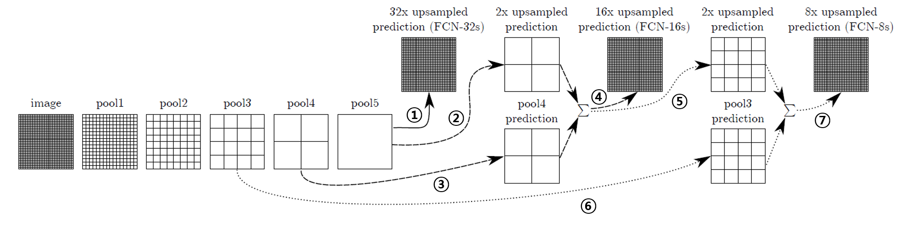

# FCN (Fully Convolutional Network)

이 논문의 저자들은, CNN 기반의 구조를 사용하여 Semantic Segmentation을 수행하는 네트워크 구조를 설계했다. 기존의 CNN은 마지막 레이어에 Fully Connected Layer가 포함되어 SOFTMAX를 수행하였는데, Convolution layer의 값이 Fully Connected Layer로 들어가면서 위치정보가 사라졌다. 또 다른 문제는 CNN의 Input Size가 고정이어야 했다는 것인데, FCN은 Fully Connected Layer를 사용하는 대신 모든 레이어를 Convolution 레이어로 바꿔서 두 가지 문제를 모두 해결했다. 이를 나타낸 그림은 아래와 같다.

논문에서는 이를 Convolutionalization이라고 표현했다. 컨볼루션 레이어로 구조를 바꾸게 되면, 공간적인 정보를 유지할 수 있게 된다. 공간적인 정보를 가지고 있는 출력 map을 __heatmap__ 이라고 한다. FCN은 이에서 한발 더 나아가, heatmap을 기반으로 원본 이미지의 해상도를 복원하여 원본 이미지에서 Object의 모양과 클래스를 분류해내는 모델을 고안했다.

### Patchwise Training
논문의 저자들은 트레이닝 과정에서 Patchwise Training도 고려해보았다고 한다. Patchwise training 기법은 모델을 트레이닝할 때, 전체 이미지를 넣는 것이 아니라 Object 주변을 분리한 이미지를 사용하는 방법을 말한다. 저자들은 Patchwise 기법은 loss를 sampling하는 모습이 되며, 전체 Image에서의 공간적인 정보가 중요한 Image Segmentation 문제에서는 전체 loss가 중요하기 때문에 patchwise는 맞지 않다고 했다.

### Model Structure
논문의 저자들은 FCN을 VGG-16 기반으로 구현했다. 이미지의 특징 추출을 위해서 VGG-16의 구조를 차용했고, GoogLeNet의 마지막 Loss layer를 사용했다. 이 때, Average Pooling을 삭제하여 성능을 향상시켰다. 그리고 나서 분류를 위한 마지막의 Fully Connected 레이어를 없애고, 대신 Fully 1x1 convolution으로 구조를 변경하였다. 모델은 PASCAL VOC로 테스트되었으며, 따라서 모델의 맨 끝에 PASCAL VOC의 클래스 개수와 맞게 21개의 Channel을 가지도록 21 x 1 x 1 크기의 Convolution을 사용하였다.

그리고 분류를 완료하면, 이전의 정보들을 이용하여 입력 이미지의 해상도를 복원하고, 복원한 해상도에서의 Object Segmentation을 수행하게 된다. 이 과정에서 Skip Connection 기법과 Deconvolution 기법이 사용되었다.

### Skip Connection
Convolution과 Pooling을 거치면서 떨어진 이미지의 해상도를 복구하고, 원했던 Image의 Segment들을 보기 위해서, 클래스의 분류가 완료된 작은 Feature Map의 해상도를 복구하여 원본 이미지의 크기로 돌려놓는 과정을 거치는데, 이 떄 Skip Connection 방법이 사용된다. 이 방법은 간단히 설명해서, 이전의 Pooling Layer들의 정보를 사용하여 이미지 Upsampling의 성능을 올리는 것이다.

Skip Connection의 진행 모습은 다음과 같다.

번호에 맞춰 천천히 따라가 보자.

__①__. pool5 레이어의 prediction map을 32의 stride로 deconvolution해서, FCN-32s라는 결과를 출력한다.

__②__.  pool5를 거친 map에 쌍선형 보간을 적용하여 해상도를 두배로 늘리며 초기화한 2x Upsample 레이어를 생성하고 학습 후, prediction map을 생성한다.

__③__.  pool4에서 prediction한 map을 구한다.

__④__.  ②에서 만든 2x Upsample map의 prediction과 ③에서 구한 pool4 map의 prediction을 더해서 단일 prediction map을 생성하고, 이 map은 16 stride로 Upsample되어 FCN-16 segmentation map을 생성한다.

__⑤__.  ④에서 만든 prediction map을 이용하여, 다시 쌍선형 보간을 이용하여 초기화한 2x Upsample 레이어를 생성하고 학습 후, prediction map을 생성한다.

__⑥__.  pool3에서 prediction한 map을 구한다.

__⑦__.  ⑤에서 만든 2x Upsample map의 prediction과 ⑥에서 구한 pool3 map의 prediction을 더해서 단일 prediction map을 생성하고, 이 map은 8 stride로 Upsample되어 FCN-8 segmentation map을 생성한다.

Pooling을 반복할수록 지역적인 위치 정보가 사라지므로, 현재 layer에서 Upsample한 결과와 이전 Pooling layer에서 예측한 결과를 같이 이용하면 더 정확한 prediction이 가능할 것이다. 또, Segmentation map의 크기는 input image와 동일하게 모두 같으므로, 2배로 Upsample된 prediction을 16 stride로 deconv한 결과와 4배로 Upsample된 prediction을 8 stride로 deconv한 결과는 prediction의 정확도에서 차이가 있을 것이다. prediction의 해상도가 높을 수록 Segmentation의 정밀도가 높아질 것이기 때문이다.

### Training
모델의 트레이닝은 기본적으로 pixel-wise multi logistic loss를 사용했다. 간단히 말해서 픽셀 단위로 SOFTMAX를 돌렸다는 소리다. 최후의 21 x 1 x 1 레이어에서 prediction을 수행한 후 Upsample하여 Segmentation map을 만들어내고, loss를 업데이트한다.

파라미터의 최적화에는 SGD with Momentum을 사용했다고 한다.
