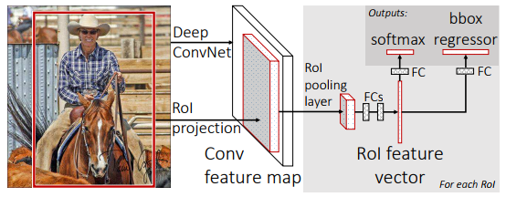
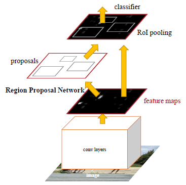
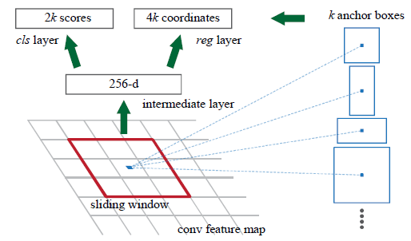
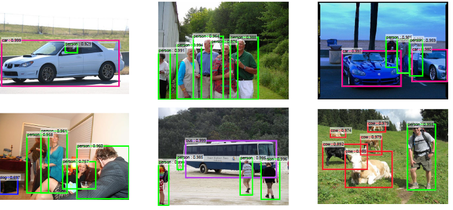

# Faster R-CNN

이번 논문은 __Faster R-CNN__ 입니다. R-CNN은 Object Detection을 수행하는 네트워크 구조입니다. Faster R-CNN은 2016년에 Microsoft에서 내놓은 주요 연구 성과 중 하나입니다.
R-CNN과 Fast R-CNN에 기반한 네트워크 구조이므로, 그 둘부터 보고 가겠습니다.

### R-CNN
예전의 Object Detection 알고리즘들은 Sliding Window 방식 즉, 일정한 크기를 가지는 Window를 가지고 이미지의 모든 영역을 탐색하면서 물체를 검출해내는 방식이었습니다. 하지만 이 방법이 비효율적임은 너무도 자명하기 때문에, Region Proposal 알고리즘이 만들어졌습니다. Region Proposal은 한마디로 __물체가 있을만한 범위__ 를 말합니다.

R-CNN의 기본적인 구조는 다음과 같습니다. 먼저 입력 이미지에서 __Selective Search__ 라는 Region Proposal 생성 알고리즘을 이용해, 물체가 존재할 것으로 추정되는 Region Proposal들을 추출합니다. 각각의 Region Proposal들은 사각형 모양의 Bounding Box 안의 이미지 형태인데, 모든 Region Proposal들에 대해서 크기를 동일하게 만든 후 CNN을 거쳐 분류하는 작업을 시행합니다.

Bounding Box : 물체가 들어 있는 범위를 예측한다.
이 과정에서 Bounding Box의 정확한 위치와 크기를 예측하는 모델을 하나 더 이용하게 되는데, Region Proposal을 이용해 이미지 분류를 시행할 경우 물체의 정확한 위치를 파악할 수 없다는 점 때문입니다. 따라서 각각의 Bounding Box가 그 내부에 포함된 물체의 정확한 위치와 크기를 잡아줄 수 있도록 하는 작업을 수행하기 위해 회귀 모델을 하나 더 구현했습니다.

### Fast R-CNN
위에서 본 R-CNN의 가장 큰 문제는 __너무 느리다__ 는 것이었습니다. 모든 Region Proposal마다 하나의 CNN을 돌려야 하니 당연히 느릴 수밖에 없었고, 이미지 특징 추출을 위한 모델, 분류를 위한 모델, Bounding Box를 잡아주는 모델을 동시에 학습해야 하니 학습에 걸리는 시간도 엄청날 수 밖에 없었습니다.

이 속도 문제를 해결하기 위해서, __Fast R-CNN__ 이라는 모델이 개발되었습니다. 말그대로 빠른 R-CNN이죠. Fast R-CNN 모델의 골자는, Feature를 입력 이미지로부터 뽑아내는 것이 아니라, CNN을 거친 Feature Map 상에서 Spatial Pyramid Pooling의 특수한 형태인 RoI Pooling을 사용하여 Feature를 뽑아낸다는 것입니다. 그림으로 보면 다음과 같습니다.

이를 통해 하나의 Region Proposal 당 하나의 CNN이 돌아가면서 느려졌던 네트워크의 구조가 획기적으로 개선되었고, 빨라질 수 있었습니다. CNN이 딱 하나만 돌아가면 되기 때문이죠.
RoI Pooling에 대한 자세한 내용은 [제 블로그 글](http://blog.naver.com/leesoo9297/221165682280)을 참고하세요.

### Faster R-CNN
Fast R-CNN으로 Object Detection의 수행 속도가 많이 빨라졌지만, 아직 성능을 개선하지 못한 부분이 있었습니다. 바로 __Region Proposal__ 을 생성하는 방식이었죠.
R-CNN과 Fast R-CNN은 Region Proposal을 생성하기 위해서 Selective Search라는 알고리즘을 사용했습니다. 이 방법으로 약 2,000개에 가까운 Region Proposal을 생성하는 것 자체가 성능에 아주 큰 병목이었습니다.

그래서 그것을 뉴럴 네트워크로 해결한 __Faster R-CNN__ 이 등장하게 되었습니다. Faster R-CNN은, Region Proposal을 생성하는 방법 자체를 CNN 내부에 네트워크 구조로 넣어놓은 모델입니다. 이 네트워크를 __RPN(Region Proposal Network)__ 이라고 합니다. RPN을 통해서, RoI Pooling을 수행하는 레이어와 Bounding Box를 추출하는 레이어가 같은 특징 맵을 공유할 수 있습니다.

Faster R-CNN의 구조를 보여주는 사진입니다. 입력 이미지에 대해 통째로 Convolution Layer를 여러 번 거쳐서 특징을 추출해내고, 그렇게 나온 출력 특징 맵을 RPN과 RoI Pooling Layer가 공유하게 됩니다. RPN은 특징맵에서 Region Proposal들을 추출해 내고, RoI Pooling Layer는 RPN에서 추출된 Region Proposal들에 대해 RoI 풀링을 수행합니다.

__RPN__ 의 작동 방식에 대해 자세히 알아보겠습니다.
RPN은 출력 특징 맵 위를 도는 지정한 크기의 Window를 Sliding 하면서, Window가 지나가는 각 지점마다 지정된 크기의 __anchor__ 를 지정한 개수만큼 생성합니다. 그리고 모든 anchor들에 대해서 가능한 Bounding Box의 좌표와 그 안에 물체가 들어있을 확률을 계산합니다. anchor들 자체가 Bounding Box의 후보군이 되는 것이죠.

Faster R-CNN : Anchor의 동작
각각의 Window 위치에서 __k개의 anchor box__ 들을 생성한 후, 각각의 위치, 크기, Bounding Box로써의 점수들을 계산합니다. __cls layer__ 로 나가는 2k개의 점수들은 해당 anchor 내에 물체가 있는지 없는지, 그 확률을 계산합니다. __reg layer__ 로 나가는 4k개의 좌표 값들은, 해당 anchor의 x, y좌표와 Width, Height 값을 가지고 있습니다. cls layer는 해당 박스 안에 물체가 존재하는지의 여부를 분류하고, reg layer는 물체를 감싸는 Bounding Box의 정확한 위치를 예측합니다. 두 layer들의 학습을 통해 물체가 들어 있는 정확한 Bounding Box, 즉 __RoI__ 들을 추출할 수 있게 됩니다.

이제 위의 방법을 통해 RPN이 생성한 RoI들에 대해서 RoI Pooling을 시행하면, 각 Region에 대한 특징 맵이 모두 다 동일하게 고정된 사이즈로 생성됩니다. 이를 통해서 각 RoI 내 물체들의 분류를 시행할 수 있게 됩니다.

Faster R-CNN의 또 다른 특징은, 모든 트레이닝을 하나의 Loss 함수로 진행하는 __Multi-task Loss__ 를 사용한다는 점입니다. 실제로 Loss 함수의 식을 보면, RPN을 학습하기 위한 Loss와 분류기를 학습하기 위한 Loss를 더한 모습인 것을 볼 수 있습니다. 이를 통해 학습을 더 빠르게, 통합적으로 진행할 수 있게 됩니다.

### Result
Faster R-CNN의 결과입니다. RPN이 예측한 RoI의 Bounding Box와 RoI마다 RoI Pooling을 수행해서 내부의 물체를 분류한 결과를 보여주고 있습니다.

