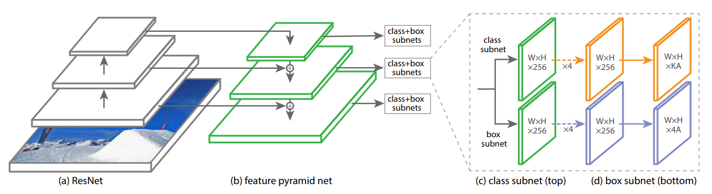
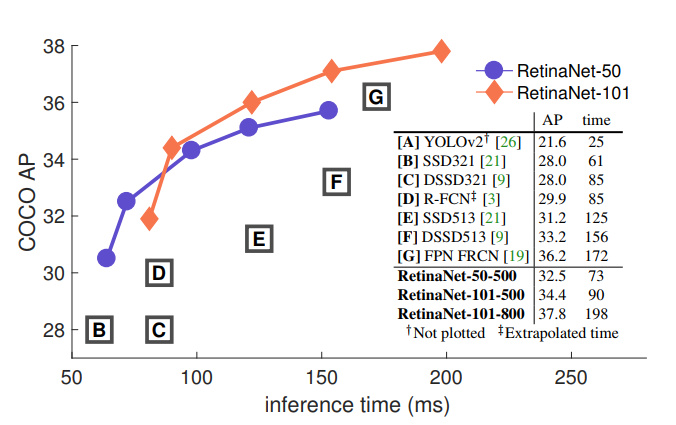
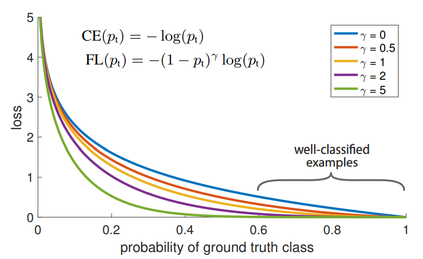

# Focal Loss for Dense Object Detection

[원 논문 : Focal loss for Dense Object Detection](https://arxiv.org/abs/1708.02002)

이 논문은 지금까지의 Object detection task가 가졌던 'Easy Negative Sample이 모델을 압도해버리는 문제' 를 Loss 함수의 재정의를 통해서 해결하고자 한 논문입니다. Easy Negative Sample이란, 쉽게 특정 클래스가 아님을 분류할 수 있는 Object를 말하는 것으로, R-CNN 계열의 모델들이 RPN에서 2000개에 달하는 RoI를 뽑아내 분류하는 과정에서 생성됩니다. Object Proposal들이 생성될 때, 배경 이미지를 포함하고 있거나 찾아내기 적당한 크기의 Object들이 __대부분의__ Bounding Box 내에 들어있게 됩니다. 하지만 Object가 너무 크거나 작은 경우, 또는 잘려 있는 경우에는 그 물체의 Bounding box와 클래스를 구하기 힘들 것입니다. 이렇게 쉬운 샘플과 어려운 샘플의 갯수 비율이 너무 크게 차이나기 때문에, 자연스럽게 Loss 함수는 쉬운 샘플들에 의해 압도당하게 됩니다. 하지만 진짜 Detector의 성능을 판가름짓는 중요한 열쇠는 Hard한 Sample들을 잘 분류하는 것이기 때문에, __쉬운 샘플들이 Loss에 미치는 영향을 약화하고, 어려운 샘플들이 Loss에 미치는 영향을 크게 하는__ 것이 이번 논문의 아이디어입니다.

R-CNN에서 Bounding box 내에 물체가 있는지 없는지를 분류하기 위해서 Binary Classification이 사용됩니다. 이 때 Loss 함수로는 Cross-Entropy Loss가 사용되는데, 식은 다음과 같습니다.

논문에서는 , 로 놨습니다. 1은 Object, -1은 Background로 생각하면 편합니다.

임을 이용해, Cross Entropy의 식을 다음과 같이 정리했습니다.

여기서 에 상관없이 이면 Confidence가 높으므로 Loss가 크게 줄어드는데, 문제는 쉽게 분류가 잘 되서 0.5를 넘기기 쉬운 Background나 클래스들이 너무 많이 Loss를 줄여버리게 됩니다. 이렇게 되면 Rare한 클래스가 Loss에 미치는 귀중한 영향을 압도해버릴 수 있습니다. 따라서 논문에서는 Weighting Factor 를 제안합니다. 는 의 범위를 가지고 있는데, y가 1일때와 -1일 때, 각각 Loss에 미치는 영향을 다르게 만들어줍니다. 일 때는 Loss에 의 Weight를 주고, 일 때는 의 Weight를 주는 식입니다. Weighting Factor가 추가된 Cross Entropy는 다음과 같습니다.

인 경우를 생각해 봅시다. 레이블 y가 1일 때는 Loss에 0.7의 Weight가 가해지고, -1일 때는 0.3의 Weight가 가해지게 됩니다.

가 높으면 어쨌든 두 경우 다 Loss를 줄이긴 하지만, 인 경우가 Loss에 더 많이 반영되는 결과를 볼 수 있습니다.

Weighting Factor 로 Positive와 Negative Sample들이 Loss에 미치는 영향의 정도는 조정해주었지만, 아직 진짜 목표인 Easy/Hard Sample들에 대한 Loss 반영 정도를 조정해주지 않았습니다. 이 부분은 Scaling Factor 로 해결할 수 있습니다.

Scaling Factor가 추가된 Focal Loss Function은 다음과 같습니다.

Scaling Factor의 역할은, 쉽게 맞춘 Sample로부터 구한 Loss를 거의 죽이다시피 약하게 만드는 것입니다. 이면 Scaling Factor는 0.01이 됩니다. 수많은 Background들을 분류해냄으로 인해서 Loss가 계속 줄어드려고 할 때, Scaling Factor를 이용하여 강제로 해당 Loss를 희미하게 만들어버리는 것입니다. 따라서 어쩌다 어렵게 분류해낸 Hard한 Sample들의 Loss 반영 비율을 Easy힌 것들에 비해 크게 높일 수 있습니다. 또 Hard한 Sample들은 가 상대적으로 낮은 경우가 대부분이기 때문에 이 Factor의 추가가 더 효과를 볼 수 있는 것입니다. 논문에서는 일 때 최고의 성능을 보였다고 말하고 있습니다.

#### RetinaNet

위의 Focal Loss가 효과적임을 증명하기 위해서, 논문에서는 새로운 Detector 모델인 RetinaNet을 고안했습니다. RetinaNet은 [FPN](https://arxiv.org/abs/1612.03144)에서 제시된 Feature Pyramid 구조를 사용해서 Bounding Box를 찾아냅니다. 여러 층의 Feature Map에서 여러 Anchor를 사용하는 방식입니다. 네트워크의 전체적인 구조는 다음과 같습니다.

이 논문에서 계속 강조하고 있는 점 중 하나는, RetinaNet의 성능이 강력한 이유가 네트워크의 구조를 잘 설계해서가 아니라 __Focal Loss가 잘 동작해서__ 라는 것입니다. 그리고 실제 Experiment 결과가 이를 증명하고 있습니다.

또한, Scaling Factor의 강도를 바꿔가면서 Loss의 변화를 측정한 그래프도 인상적입니다.

