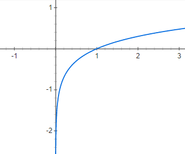
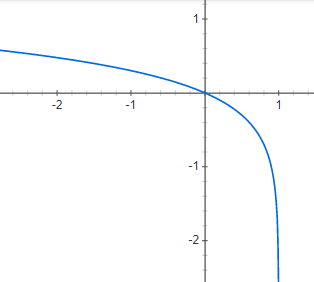
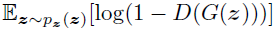
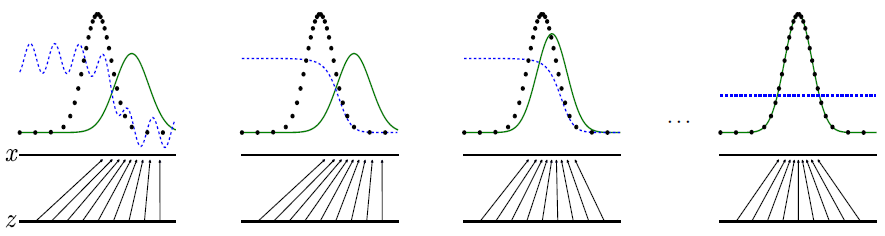
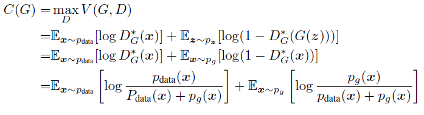
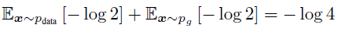

# GAN (Generative Adversarial Networks)

Generative Adversarial Network, 즉 GAN은 2016년 들어 큰 주목을 받은 대표적인 비지도 학습(Unsupervised Learning) 방법입니다. 기본적인 아이디어는 __두 모델간의 대립을 통해 데이터를 생성하는 최적의 모델을 만들어내자__ 라는 것입니다. 논문에서는 이를 지폐위조범과 경찰의 사례를 들어 재미있게 설명하였습니다. 너무 유명한 예시라 간단히 설명하자면, 위조 지폐를 만드는 범인과 위조 지폐를 감별하는 경찰이 서로를 이기기 위해 경쟁하면, 결국 범인이 만드는 위조 지폐가 실제 지폐랑 거의 동일해져 경찰이 둘을 구분할 수 없는 상태에 이른다는 것입니다.

GAN의 저자들은 실재로 그런 모델을 설계했습니다. 이미지를 생성하는 모델인 G를 만들고, 이미지가 트레이닝 데이터에서 나온 것인지 G가 생성해낸 것인지 감별하는 모델 D를 둡니다. G는 D가 자신이 만든 이미지를 트레이닝 이미지와 구별하지 못하게 만드는 방향으로 학습을 하고, D는 최대한 그 둘을 구별하기 위해 학습을 합니다. 그럼 G가 이미지를 진짜같이 생성하는 능력이 점점 오르게 되고, D가 이미지를 제대로 판별할 확률은 결국 2분의 1이 됩니다.

GAN의 목적은, __트레이닝 데이터의 분포를 생성 모델이 똑같이 따라가도록 학습__ 하는 것입니다.

확률변수 에 대한 확률밀도함수가 있을 때, 어떤 에 대해서 함숫값이 크다면 전체 분포 내에서 그 가 차지하는 비율이 크다는 의미입니다.
GAN에서는 이미지를 하나의 고차원 벡터로 보았고, 입력 이미지 데이터들의 특징이 담긴 벡터들의 확률분포를 이용해서 이미지의 특징별로 해당하는 확률변수의 크기를 구합니다.
만약 입력 이미지 데이터에 고양이 사진이 많이 포함되어 있었다면, 고양이의 이미지 정보가 담겨있는 비슷한 벡터들의 확률 밀도 값은 클 것입니다.
반대로 입력 이미지들과 거리가 먼 Noise에 가까운 이미지들은 확률분포에서 매우 낮은 값을 가지게 됩니다.
이런 방식으로 해서 입력 이미지의 분포를 파악할 수 있습니다.

GAN의 목표는, 입력 이미지 데이터의 분포를 생성 모델이 똑같이 따라하도록 만드는 것입니다.
두 개의 확률분포간의 차이를 줄여주는 것이 주 목표입니다.

GAN은 DIscriminator Model과 Generator Model로 구성되어 있습니다. Discriminator는 의 함수로 나타내고, Generator는 의 함수로 나타냅니다.
는 이미지 가 학습용 원본 이미지 데이터에서 나왔을 확률을 계산합니다. 따라서 에 학습용 데이터가 들어오면, 는 1에 매우 가까울 것입니다.
는 임의의 코드 값인 를 받아서, 그에 대응하는 가짜 이미지를 만들어냅니다.
학습 초반에는 당연히 가짜 이미지의 티가 강하게 날 수밖에 없습니다. 따라서 는 학습 초반에 0에 가까울 것입니다.

Discriminator의 학습은 간단합니다. 진짜 이미지가 들어왔을 때 는 1을 출력하도록 학습하고, 가짜 이미지가 들어왔을 때는 0을 출력하도록 학습합니다.
Generator의 임무는 __진짜같은 가짜 이미지를 생성__ 하는 것입니다. 따라서 Generator는, 코드 를 받아 생성한 가짜 이미지 에 대해서 가 1에 가까운 출력을 보이게 만들도록 학습합니다.

위의 내용을 한 줄로 나타낸 수식입니다. GAN의 목적 함수이기도 합니다. 함수 에 대해서, Generator는 이를 최소화하는 방향으로 학습해야 하고, Discriminator는 이를 최대화 하는 방향으로 학습해야 합니다.

먼저 이 식을 Discriminator가 최대화하는 입장에서 봅시다.
앞 항을 보면, 입력 데이터의 분포 에서 이미지 를 모두 샘플링해서 에 대한 기댓값을 구하고 있습니다. 는 일 때 최대화되므로, 실제 데이터가 D에 입력되었을 때 1을 내뱉으면 를 최대화하려는 움직임에 부합하게 됩니다.
뒤 항을 보면, 가우시안 분포를 따르는 임의의 코드 를 전체 샘플링해서, 에 대한 기댓값을 구하고 있습니다.가 0일 때 는 최대가 되므로, Discriminator가 Generator가 생성한 이미지를 가짜라고 잘 판별했을 때 를 최대화할 수 있습니다.
기댓값 연산의 정의에 따르면, 여기서는 사실상 총합 연산과 비슷한 맥락에서 쓰이고 있는 것을 알 수 있습니다.

이제 이 식을 Generator가 최소화하는 입장에서 봅시다.
Generator는 앞 항에는 관여할 수 없습니다. 항에서 의 관련성이 없기 때문입니다.
뒤 항을 보면, 는 가 1이 되었을 때 음의 무한대로 발산하며 최소가 됩니다. 그리고 가 1이라는 것은, Generator가 만들어낸 이미지를 Discriminator가 진짜 이미지랑 구별하지 못한다는 것을 의미합니다. 따라서 G는 를 최소화하는 방향으로 학습을 진행할 수 있습니다.

나중에 참고하기 위해, 와 의 그래프 사진을 넣어 놓았습니다.

하지만 논문에서 저자들은, Generator를 학습할 때  를 최소화하는 방향으로 학습하지 않았습니다. 그 이유는 간단합니다. 학습 초반에 Generator가 가짜 이미지 티가 팍팍 나는 생성을 반복할 때, 는 계속 0 근처에 머무르게 됩니다. 이 때 의 값은 계속 1에 가까우므로, 기울기가 약해서 학습이 잘 되지 않는 문제가 발생합니다. 그래서 논문의 저자들은, 를 최대화 하는 방향으로 학습을 진행했습니다. 이렇게 되면 학습 초반에 의 값이 음의 무한대에서 가까이 시작하기 때문에, Generator가 좋지 못한 이미지 생성을 반복하는 시기를 빠르게 탈출할 수 있게 됩니다.

를 각각 최소화하고 최대화하면서 학습하는 과정은, 결국 원본 이미지 데이터의 분포와 Generator가 생성하는 이미지 데이터의 분포의 차이를 줄이는 것과 동일합니다.
JSD(Jenson-Shannon Divergence)를 통해 두 확률분포의 차이를 계산하게 되는데, JSD는 다시 KL Divergence를 통해 다음과 같이 정의됩니다.

KL Divergence는 [제 블로그 글](https://blog.naver.com/leesoo9297/221163322826)을 참고하시면 좋겠습니다. GAN의 학습이 완료되면 는 결국 0이 됩니다.

위에서 설명한 GAN의 학습 과정을 한 장으로 나타낸 그림입니다.
검정 실선은 학습 데이터 의 분포를 나타내고, 초록 실선은 Generator가 생성하는 분포인 를 나타냅니다. 파랑 점선은 Discriminator Model인 를 나타냅니다. 또한  선에서  선으로 뻗어나간 데이터는, 저차원 벡터인 임의의 코드 를 이미지 생성을 위해 고차원 이미지인 에 매핑시키는 작업을 의미합니다.

그림 (a)는 학습 초기 상태를 나타내는 그림으로, Generator가 원래 데이터의 분포에 한참 못 미치고 있으며, Discriminator도 제대로 분류를 하지 못하는 모습을 보입니다.
(b) 그림은 Discriminator의 학습을 진행한 후의 모습을 보여줍니다. 가 원본 데이터에 대해서는 1, Generator의 이미지에 대해서는 0을 출력하는 모습을 볼 수 있습니다. 그리고 세 개의 선이 동시에 만나는 점을 볼 수 있는데, 저 지점의  데이터에 대해서는 Generator가 완벽하게 이미지를 생성해낸다는 이야기입니다. Discriminator가 동일한 확률밀도로 인해 진짜와 가짜 이미지를 구별하지 못하기 때문입니다.
(c) 그림은 Generator의 학습이 진행된 후의 모습입니다. Generator가 생성하는 이미지의 분포가 점점 학습 데이터와 비슷해지는 것을 볼 수 있습니다.
(d) 그림은 최적화가 완료된 상태를 보여주는 그림으로, 확률분포의 모든 구간에서 Generator의 분포와 학습 데이터의 분포가 동일하게 되어 Discriminator가 둘을 전혀 구분하지 못하는 상태가 된 것을 보여줍니다.

GAN의 저자는 몇 가지 이론적인 결과들을 도출했는데, 첫 번째는 고정된 G에 대해서 Optimal한 D_G는 항상 다음 수식과 같다는 것입니다.

이를 증명해보자면, 기댓값 연산을 적분으로 바꾸면 다음 식이 도출됩니다.

뒤쪽 적분항에서 를 샘플링하여 로 매핑하는 것 대신 Generator의 분포 에서 고차원 이미지 를 바로 뽑고 바로 DIscriminator에 넣어주었습니다. Generator가 상관없다는 가정이 붙기 때문에 이것이 가능합니다. 이렇게 되면 적분 범위가 로 통일되므로 적분 항을 하나로 합칠 수 있게 됩니다. 또한 미분이 가능해지는데, 로 치환하면 식이 의 꼴로 바뀝니다. 이를 미분하면  가 되고, 치환을 다시 돌려놓으면 와 같아집니다. 적분을 다시 기댓값 연산으로 바꾸면 끝납니다.

두 번째 이론적 결과는, GAN이 학습을 완료하여 두 분포가 완벽히 같아졌을 때, Discriminator가 최대화한 는 와 같다는 것을 증명한 것입니다.

는 트레이닝을 위한 목적 함수입니다.

G가 고정되어 있고 D가 Optimal일 때의 minimax 목적 함수 를 다음과 같이 나타낼 수 있습니다. 

optimal한 D는 이라고 나타냄을 앞에서 봤습니다. 는 D가 Optimal할 때를 가정하고 있으므로, 두 번째 식으로의 변환이 가능해집니다. 그 다음 식에서는, Generator가 생성하는 이미지를 코드 를 이용해 생성하는 것이 아니라, 생성 모델의 분포 에서 원래 크기로 생성된 이미지를 바로 뽑아오는 방식으로 변경합니다. 그리고 위에서 정의했던 의 형태를 바꿔 줍니다. 둘은 물론 동치입니다.

학습이 완료되었을 때, 즉 일 때는  가 됩니다. 따라서 위 식은 다음과 같이 정리됩니다.

원래의 는 다음과 같이 정의됩니다.

JSD의 정의를 이용해 KL Divergence로 바꾸면 아래와 같습니다.

일 때 두 개의 KL Divergence는 0이 되므로, 위에서 정리했던 만 남게 됩니다. 그리고 저 때 Global Optimum에 도달함은 이미 위에서 봤습니다.
