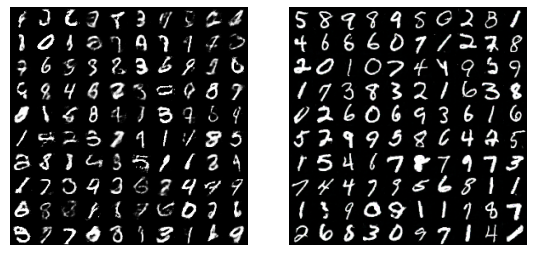

# Improved Techniques for Training GANs

[원 논문 : Improved Techniques for Training GANs](https://arxiv.org/pdf/1606.03498.pdf)

### Introduction
 GAN은 게임 이론에 기반하여 생성 모델을 학습하는 방법론입니다. 최근의 GAN 모델들은 좋은 품질의 샘플을 생성합니다. Generator와 Discriminator 모델이 서로 경쟁하면서 더 좋은 품질의 가짜 샘플을 만들어내도록 학습됩니다. 이론적으로 GAN을 트레이닝하는 과정은, 연속적이고 고차원의 파라미터들을 가진 non-convex game에서 __Nash equilibrium__ 을 찾는 일입니다. 하지만 GAN은 전형적으로 두 모델 간의 Nash Equilibrium을 찾는 일 보다는, Gradient Descent 알고리즘을 사용하여 cost 함수를 최소화하는 과정에 초점이 맞춰져 있습니다. 이론적인 방식으로 Nash Equilibrium을 찾으려고 하면, 알고리즘이 수렴에 실패할 것이기 때문입니다.
 따라서 논문에서는, 학습하는 GAN 모델이 해결하는 __Game__ 을 수렴시키기 위한 여러 방법들을 제안합니다.
 
### Toward Convergent GAN Training
 이 섹션에서는, GAN을 두 모델 간 Game이 수렴하는 방향으로 트레이닝하기 위한 여러 테크닉들을 제시합니다. 먼저 기존 GAN 트레이닝 시에 어떤 문제가 발생했는지 이론적으로 짚고 넘어가겠습니다.

 GAN을 트레이닝하는 과정은 Generator와 Discriminator의 두 모델이 상호 비협조적으로 관여하는 게임에서 Nash Equilibrium을 찾아내는 과정입니다. 두 모델은 각각의 Cost 함수를 최소화하려고 합니다. Discriminator 의 Parameter를 , Generator 는 라고 할 때, 각각의 Cost 함수는 와 로 나타낼 수 있습니다. 이 때 Nash Equilibrium은, 가 에 대해 최소가 되고, 가 에 대해 최소가 되는 점 입니다. 하지만 GAN에 대해서 이런 균형점을 찾는 것은 매우 어려운 일입니다. 애초에 Nash Equilibrium을 찾을 수 있는 문제 자체가 특별한 경우로 한정되어 있는데다가, non-convex 문제이면서 parameter들이 연속적이고, 매우 고차원 공간 상의 문제를 다루는 GAN Game에 이 이론을 적용할 수 있는지 불확실하기 때문입니다.
 
 각각의 플레이어가 각각의 목적 함수를 최소화할 때 Nash Equilibrium에 도달한다는 아이디어는, GAN에서 각 모델의 cost를 최소화하여 이 Game을 수렴시킬 수 있다고 생각하게 만들기에 충분했습니다. 하지만 GAN과 같이 상호 비협조적인 Game의 특성 상, 를 최소화하기 위해 를 변경하면 자연스럽게 가 증가하게 되고, 반대로 를 최소화하기 위해 를 변경하면 가 증가합니다. 이전의 GAN 모델들은 이런 수렴 가능성의 부족에도 불구하고, 이론적으로 정립된 모습을 취하기 위해서 두 모델의 cost를 동시에 줄이는 방법을 택했습니다. 이 논문에서는 이 상황을 기반으로 하여, 모델의 수렴 가능성을 높일 수 있는 몇 가지 방법을 제시합니다.
 
#### Feature Maching
 이 기법은 Generator가 현재의 Discriminator 모델보다 먼저 트레이닝되는 경향을 방지하기 위해 새로운 목적 함수를 추가하는 방법입니다. Generator가 생성한 샘플이 무조건 Discriminator의 출력을 크게 만드는 방향으로 학습하게 하는 대신, 목적 함수에 Generator가 실제 데이터와 비슷한 이미지를 생성하도록 만드는 부분을 추가합니다. 정확히 말하면, Generator가 Discriminator 모델의 중간 레이어에 표현된 Feature 값에 맞추어지도록 학습하는 것입니다.
  가 Discriminator의 중간 레이어들과 Activation을 거친 출력이라고 할 때, Generator에 추가할 새로운 목적 함수는 다음과 같습니다.
  
  
  
 Discriminator에 실제 데이터를 입력했을 때 Activation을 거친 후의 출력과 Generator가 만들어낸 가짜 이미지를 Discriminator에 넣었을 때의 출력의 차를 구합니다. 이를 최소화하는 과정은 결국 Generator가 실제 이미지의 Feature에 맞추어 이미지를 생성하도록 학습하는 것으로 이어지겠죠.
 
#### Minibatch Discrimination
 GAN이 학습에 실패하는 대표적인 증상 중 하나가 __Mode Collapse__ 문제입니다. Collapse에 가까워지면, Discriminator의 Gradient는 비슷한 데이터 포인트들에서 비슷한 방향을 향하게 됩니다. 이는 Discriminator가 각각의 샘플들을 독립적으로 보기 때문입니다. 따라서 Gradient들을 상호간에 맞추어 조정할 수도 없기 때문에, Generator의 출력이 다양해지게(Dissimilar) 만들 방법이 없습니다. 따라서 Generator는 Discriminator가 높은 확률로 진짜 데이터라고 믿는 하나의 데이터를 생성하는 포인트로 수렴하게 됩니다. Collapse가 일어나면, Discriminator는 Collapse가 일어난 그 하나의 포인트가 Generator가 생성한 데이터라는 것을 학습합니다. 하지만 Gradient Descent로는 비슷한 Sample들을 구분할 수 없기 때문에, Discriminator는 그 하나의 포인트에만 반응하도록 학습됩니다. 결국 Generator는 실제 데이터의 Distribution에 수렴할 수 없습니다. 이 문제를 해결하기 위해서 논문의 저자들은, Discriminator가 독립된 샘플들을 각각 보게 하지 말고, 여러 샘플들이 담긴 __Minibatch__ 를 분류시키자는 아이디어를 제안했습니다.
 
 __Minibatch Discrimination__ 의 아이디어는 간단합니다. Discriminator가 Sample들을 각각 보는 것 보다는 여러 개의 Sample들을 한번에 보게 만드는 것이 Collapse를 해결하는 데에 도움을 준다는 것입니다. Batch Normalization을 Discriminator에 사용한 결과가 이것이 실제로 효과가 있음을 보여주었습니다. 논문의 저자들은, 지금까지 Generator의 __특히 가까운 Sample__ 들을 목표로 하는 모델에 실험을 제한했다고 말합니다. 논문에서는 Minibatch 내 Sample끼리의 'closeness'를 계산하기 위한 새로운 방법을 정의하고, 이를 이용해 Minibatch로 Discrimination하기 위한 새로운 방법을 제안합니다.
 
 입력 를 Discriminator에 넣었을 때, 중간 레이어들을 거치고 생성된 Feature vector를 라고 합니다. 이 벡터를 임의의 텐서 와 곱하면 행렬 를 얻을 수 있습니다. 이제 Minibatch의 각 행렬들의 같은 row vector끼리 L1 Distance를 구하고 Negative Exponential을 취합니다. 예를 들어, 번째 row는 다음과 같이 계산됩니다.
 
 
 
 이 때, 번째 row에 대한 출력 는 Minibatch의 나머지 샘플들에서 구한 들의 총합으로 이루어집니다. 
 
 
 
 그리고 하나의 Sample에 대한 Minibatch Discriminator의 출력은 아래와 같이 모든 row에서 구한 output의 집합으로 이루어집니다.
 
 
 
 Minibatch에 총 개의 샘플이 있을 때, 이 작업은 번 반복되어 최종적으로 아래 모양의 Discriminator Output이 생깁니다.
 
 
 
 논문에서는 아래와 같은 그림으로 요약하고 있는데, 이렇게 봐도 이해하기 힘든 그림이긴 하지만, 이 이상으로는 그릴 수가 없어서 그대로 올려놓겠습니다.
 
 
 
 논문에서는 이런 Minibatch단위 계산을 Generator가 생성한 Sample과 실제 데이터에 대해 따로 수행하고 있습니다. 이전에는 Discriminator가 하나의 샘플만을 보고 진짜와 가짜를 구별해야 했다면, Minibatch Discrimination을 통해 구분을 위한 __Side Information__ 을 제공할 수 있게 되었다고 논문에서는 주장합니다.
 
#### Historical Averaging
 이 기법은, 과거 Parameter들의 평균에서 현재 Parameter가 멀어지는 것을 방지합니다. 이를 통해 Parameter의 경향을 파악하고, 급격한 변화를 방지합니다. 방법은 간단합니다. 가 이전 번째의 Parameter라고 놓을 때, 두 모델의 cost에 각각의 Parameter들에 대해 다음 항을 추가해줍니다.
 
 
 
 논문에서는 이 방법을 사용하여 낮은 차원의 연속적 non-convex game에서 Equilibrium을 찾을 수 있음을 확인했습니다. 따라서 이 방법을 GAN의 Equilibrium을 찾는 데에 활용하였다고 합니다.
 
#### One-sided Label Smoothing
 __Label Smoothing__ 은, 분류기의 Target value를 0과 1이 아닌 0.9, 0.1 등으로 약간의 변화를 주는 기법입니다. 이는 인공신경망의 학습에 방해가 되는 __Adversarial Example__ 들에 의해서 생기는 신경망의 취약성을 줄여준다는 점을 확인하였습니다.
 
  Positive Label을 1 대신 , Negative Label을 0 대신 로 놓았을 때, Optimal Discriminator 는 다음과 같습니다.
  
   
   
  하지만 이 식의 분자에 이 들어가서 생기는 문제는, 가 0에 가깝고 이 큰 구간에서는 에서 Sampling한 가짜 Sample이 실제 데이터에 가까워지도록 자극할 수 없다는 것입니다. 따라서 논문의 저자들은 Positive Label만 Smoothing하고, Negative Label은 그대로 0으로 놔두었습니다.
  
#### Virtual Batch Normalization
 Batch Normalization은 특히 GAN의 Generator에 사용되었을 때 좋은 성능을 보이긴 합니다. 하지만 특성상 가지는 문제가 있는데, 네트워크의 입력 에 대한 출력이 Normalization에 사용되는 Batch 내의 다른  샘플들에 영향을 크게 받는다는 것입니다. 따라서 논문의 저자들은 이를 해결하기 위한 __Virtual Batch Normalization__ 을 제안합니다. 방법은 단순합니다. Batch Norm을 한 번이 아닌 두 번 시행하는데, 하나는 현재 를 가지고 시행하고, 하나는 네트워크의 트레이닝을 시작할 때 미리 유일하게 추출해놓은 __Reference Batch__ 를 이용해 시행합니다. VBN은 두개의 Minibatch에 대한 순전파 연산을 시행해야 하므로 컴퓨팅 부하가 큽니다. 따라서 논문의 저자들은 이 기법을 Generator 네트워크에만 이용했다고 합니다.
 
### Assessment of image quality
GAN은 특히, 모델의 성능을 객관적으로 평가하기 위한 Objective Function이 부족합니다. 이는 GAN의 특성이기도 한데, 출력 데이터가 실제와 같은지 판단하는 작업은 사실상 인간의 판단에 의한 것이 아니면 수행하기 힘들기 때문입니다. 지금까지는 이 작업을 ImageNet의 레이블링 작업을 수행했던 플랫폼인 'Amazon Mechanical Turk'라는 온라인 크라우드소싱 툴을 이용하여 수행했습니다. 사람들에게 이미지를 보여주고, 진짜 이미지인지 Generator가 생성한 가짜 이미지인지 고르라고 하는 식입니다. 하지만 이런 방식에는 분명한 단점이 있습니다. 사람마다 매우 다양한 기준을 가지고 있어 정확한 metric이 없으며, 분류하는 사람들에게 분류를 실수함에 대한 Feedback을 준 후에는 사람들이 샘플을 더욱 비판적으로 보기 시작했다는 것입니다. 따라서 가짜 샘플을 구별해낼 확률도 높아졌습니다.
따라서 논문에서는 인간에 의존한 성능 평가 대신, 자동으로 일정한 metric을 이용해 샘플 생성 성능을 판단하기 위한 방법을 제안했습니다.

생성한 이미지에서 이미지 레이블을 찾아내기 위한 Inception Model을 도입했습니다. 이미지 샘플이 , 레이블이 일 때, Conditional Label Distribution 가 최대한 작은 Entropy를 가지도록 학습합니다. 이는 즉, 이미지에서 레이블을 정확히 판단할 수 있도록 한다는 이야기입니다. 또 논문에서는 의 엔트로피가 최대한 커지도록 학습하는데, 이는 레이블이 최대한 다양해짐, 즉 이미지의 생성이 다양해짐을 의미합니다. 이 둘을 결합하여 제시되는 새로운 Metric은 다음과 같습니다.

값의 비교를 쉽게 하기 위해서 Exponential을 취합니다. 와 의 엔트로피 차이가 커질수록 위 식의 값은 커집니다. 그리고 엔트로피 차이가 커진다는 것은, 이미지 생성이 다양하면서도 정확해진다는 이야기입니다. 논문에서는 이 metric이 사람의 판단에 의한 성능 평가만큼 좋은 메트릭임을 보였다고 소개하고 있습니다. 또한 일정하게 정해졌으며 자동으로 구할 수 있는 메트릭을 사용함으로써, 샘플의 개수가 매우 많은 경우에도 샘플 생성의 다양성을 측정할 수 있는 지표가 생겼다고 말하고 있습니다.

### Semi-supervised Learning
 입력 데이터 를 개의 클래스로 분류하는 분류기가 있다고 합시다. 이 모델은 를 입력으로 받아 길이가 인 벡터 를 출력합니다. 이 벡터에 SOFTMAX를 적용하면 아래와 같이 각 클래스일 가능성(Probabilities)로 변경됩니다.
 
 
 
 분류기 모델의 Supervised Learning에서는, 정답 레이블과 모델의 클래스 예측  간의 Cross-Entropy를 최소화하는 방향으로 학습합니다.
 
 논문의 저자들은 이 분류기의 학습 방식을 이용해 GAN의 Semi-supervised Learning을 제안합니다. 분류기의 학습을 위한 데이터셋에 Generator가 생성한 샘플들을 "generated"라는 새로운 클래스로 추가합니다. 이 클래스의 레이블은 이며, 따라서 분류기의 출력 벡터의 길이는 가 됩니다. 이 때, 는 입력 가 Generator가 생성한 가짜 이미지일 확률을 의미합니다. 이는 곧 Original한 GAN Objective 내의 와 같습니다.
 
 위의 사실을 이용하면 GAN의 Objective를 마치 Supervised Learning과 같이 바라볼 수 있습니다. 논문에서는 두 개의 Loss를 이용해 Semi-supervised Learning을 도입합니다.
 
 
 
 먼저 Supervised Loss 는, 데이터셋 내 진짜 데이터들에 대한 분류기 학습을 진행합니다.
 
 
 
 그리고 Unsupervised Loss 는, 일반적인 GAN Game의 Objective Function과 동일한 모습입니다.
 
  
  
 위에서  이 와 같다고 했으므로, 다음과 같이 바꿀 수 있습니다.
 
 
 
 Unsupervised Loss를 사용한 Semi-supervised Learning은 G 모델을 트레이닝하는 데에서 Minibatch Discrimination보다 더 좋은 성능을 보여주었다고 논문에서는 소개하고 있습니다.
 
 #### Importance of labels for image quality
 Semi-supervised Learning을 도입하면, 모델의 성능 평가를 인간의 판단으로 진행헀을 때에, Generator의 이미지 생성 품질이 향상되는 놀라운 효과도 거둘 수 있었습니다. 논문에서는, 사람의 시각 시스템이 어떤 물체를 분류할 때, 물체의 특징을 파악할 수 있는 이미지의 일부에 강하게 반응하는 것과 같은 맥락이라고 설명합니다. Discriminator가 이미지의 클래스를 분류하도록 학습함으로써, 인간의 시각 시스템이 강조해서 보는 이미지의 특징을 Generator가 개발하도록 만들어준다는 것입니다.
 
 ### Experiments
 

 MNIST 생성 실험 결과입니다. 왼쪽은 Semi-supervised Learning만 적용한 결과이고, 오른쪽은 Minibatch Discrimination을 적용한 결과입니다.
 
 
 
 이번엔 ImageNet 데이터셋입니다. 왼쪽은 일반 DCGAN이고, 오른쪽은 이 논문의 여러 방법(Semi-supervised Learning, Feature Matching) 등을 활용한 결과입니다.