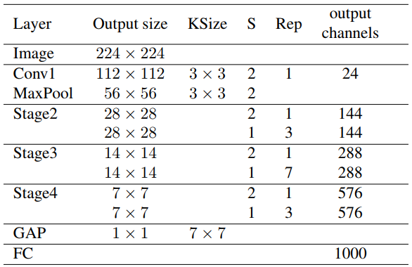

# Light-Head R-CNN

[원 논문 : Light-Head R-CNN: In Defense of Two-Stage Object Detector](https://arxiv.org/abs/1711.07264)

### Introduction
이 논문은 제목에서도 볼 수 있듯이, '왜 Two-Stage Detector들은 이렇게 느린가?' 라는 의문에서 시작합니다. 그리고 현존하는 어떤 Object Detection 모델들보다 훨씬 빠르고 강력한 모델인 __Light-Head R-CNN__ 을 고안해냅니다.

이 논문을 읽기 위해서는 두 가지 단어의 뜻을 먼저 알고 가야 합니다. 먼저 __Body__ 는 Fast R-CNN 계열 Two-Stage Detector에서 Region Proposal을 만드는 부분을 말합니다. R-CNN이나 Fast R-CNN에서는 Selective Search 알고리즘을 사용해서 이미지 위를 돌면서 Proposal을 생성하고, Faster R-CNN에서는 RPN 네트워크 위에서 Anchor들을 사용하여 Proposal들을 생성합니다. 이런 구조들이 Body입니다. __Head__ 는 Body에서 생성한 각 Proposal들에 대한 Recognition을 수행하는 부분입니다. 여기에는 Bounding Box를 찾는 Regression과 물체 클래스 분류 작업이 포함됩니다.

기존의 Two-Stage Detector들은 Backbone Network가 뒤에 붙은 __Heavy한 Head 구조__ 를 가지고 있었습니다. Faster R-CNN의 경우에는, 모든 RoI에 대해 Fully-Connected Layer가 두 층이 붙는데, 이게 가벼운 Layer도 아닐 뿐더러 여러 Proposal들에 대해서 각각 돌려줘야 했습니다. 또 RoI Pooling 이후에 채널 수가 많아지는데, 때문에 FC Layer에 들어갈 때 메모리를 많이 잡아먹게 되고 속도도 느려지는 문제가 있었습니다. R-FCN은 네트워크 구조가 상대적으로 무겁지는 않았지만, 클래스가 많아지고 풀링의 사이즈가 커질수록 Score Map의 크기가 커지는 문제점이 있었습니다. 당장 클래스 개수가 80개인 COCO 데이터셋의 분류를 위한 R-FCN에서 7 x 7 사이즈로 풀링을 한다 가정했을 때 3969 채널이 계산되는 것을 보실 수 있을 겁니다.

기성 Single-Stage Detector(YOLO, YOLOv2, SSD) 등은 fps가 약 40 이상을 보이면서 매우 빠른 모습을 보여주고 있습니다. 하지만 Object Detection의 정확도가 Faster R-CNN 계열의 Two-Stage Detector에 비해서 현저히 떨어지는 모습을 보였습니다. 반대로 Two-Stage Detector들은 속도가 5 fps 등 상대적으로 매우 느린 대신에, Single-Stage보다 많은 물체들을 정확하게 검출해 내는 모습을 보여주고 있습니다. 이 Two-Stage Detector들은 Body와 Head가 분리되어 있고, 상대적으로 Head가 무거운 구성을 취하고 있습니다. 결국 Detection의 정확도가 높으려면 속도를 포기하고 Head가 무거워야 한다는 말이 됩니다.

위와 같은 이유로 논문의 저자들은 Backbone Network의 크기와 상관 없이 현재 Two-Stage Detector의 State-of-the-art 모델인 Mask R-CNN과 Single-Stage Detector의 최고 모델인 RetinaNet을 모두 능가하는 성능을 가지는 Two-Stage Detector인 Light-Head R-CNN을 제안했습니다.

### Model Structure

이 모델은 아래의 몇 가지 중요한 점으로 요약할 수 있습니다.

- Xception 모델을 참고한 __가벼운 Backbone Network__
- Large Separable convolution을 활용한 __얇은 Feature Map__ 의 생성
- 얇아진 Feature Map에서 __PS RoI Pooling__ 을 사용해 R-CNN subnet(Head)의 성능 유지
- 가벼운 Single fully connected Layer의 사용 

논문에서는 기존 Faster R-CNN, R-FCN과 모델의 구조를 비교하고 있습니다. 모델의 전체적인 모양을 볼 수 있습니다.

논문의 저자들은 모델을 구현할 떄 두 가지 케이스로 나누어서 진행했습니다. 약간의 세팅만 달리 하고 나머지 파라미터들은 모두 공유하는 모델 S와 L을 동시에 만들었습니다. 세팅 L은 Large Backbone Network를 가지는 모델로, Performance를 검사하기 위한 목적으로 구현됩니다. 세팅 S는 Small Backbone Network를 가지는 모델로, 모델의 Efficiency를 테스트하기 위한 목적으로 사용됩니다. 나머지의 모든 세팅은 두 모델이 공유합니다. L 모델은 Basic feature extractor, 즉 Backbone Network로 ResNet-101을 사용했고, S 모델은 Xception-like 모델을 사용하였습니다.

두 모델을 기반으로 위의 중요점들을 천천히 살펴보겠습니다. 먼저 Xception과 Separable Convolution은, [동명의 논문](https://arxiv.org/abs/1610.02357)에서 제안한 방법론입니다. 이를 참고해서 이 논문에서 Separable Convolution을 구현한 모양은 다음과 같습니다.

은 입력 채널 수입니다. 는 중간 파라미터로, S 모델은 64, L 모델은 256으로 설정하였습니다. 은 에 맞추는데, 는 RoI Pooling의 사이즈로, 논문에서는 7을 사용하였습니다. 따라서 490으로 맞춰졌습니다.

이런 방식의 Separable Convolution은 Backbone Network의 출력 Feature map에서 R-CNN subnet으로 넘어가는 Feature map을 만드는 과정에서 사용됩니다. 넓은 Receptive Field를 보는 것을 유지하면서도 강한 Feature Extraction을 하기 위해 이 방식을 도입했다고 합니다. 이는 Backbone의 마지막 Feature를 잘 담고 있으면서도 얇은 Feature map을 만들어낼 수 있게 해 줍니다. 논문에서는 COCO 데이터셋을 사용했을 경우로 예를 들고 있습니다. COCO 이미지들의 클래스는 80개입니다. 이 때, R-FCN에서 7 x 7 사이즈의 PS RoI Pooling을 적용하기 전 마지막 Feature map의 Depth는 (81 x 7 x 7) = 3969입니다. 엄청 두꺼운 것을 볼 수 있죠. 하지만 이 논문의 방법을 사용하면, 같은 경우의 Depth를 (10 x 7 x 7) = 490으로 줄일 수 있습니다. 이렇게 Feature Map이 얇아지면, 메모리 사용량이 감소하고 속도가 향상될 수 밖에 없다는 것입니다.

이렇게 만든 Feature map에서 PS RoI Pooling을 사용해 각 RoI들의 Feature를 잡아냅니다. 논문에서는 그냥 RoI 풀링도 상관없다고 합니다. 다만 출력 Feature Map에서 PS-RoI Pooling을 사용하여 효과적으로 Channel을 감소시키고 R-CNN subnet으로 넘어갈 때 Global Average Pooling의 필요성을 없앤다는 점을 강조하고 있습니다.

그리고 가벼운 하나의 FC가 풀링 레이어 뒤에 붙습니다. 이게 R-CNN Subnet으로, 2048 채널의 FC입니다. Faster R-CNN에서 두 층 이상의 FC를 사용한 것과 대조적입니다. GAP를 사용하지 않고, FC를 여러 층 쓰지 않음으로써 Feature Representation을 최대한 활용한다고 하는데, 이건 솔직히 모르겠습니다. FC에 들어가는 순간 Feature가 깨질텐데 말이죠.

어쨌든, 위와 같은 방법을 이용해서 시간 효율은 유지하면서도 얇은 Feature Map에서 강력한 특징 추출과 Recognition이 가능해졌다고 합니다.

### Training / Testing

최종적으로 논문에서 목표하는 궁극적인 모델을 트레이닝할 때는, 세팅 L을 그대로 유지한 채 Backbone Network를 ResNet-101에서 Xception-like하게 직접 만든 네트워크로 대체했다고 합니다. 그 네트워크의 구조는 아래 표와 같습니다.

S는 Separable branch의 개수, Rep는 반복 횟수를 의미합니다. 이렇게 해도 생각보다는 깊어 보이는듯 합니다.

RoI는 트레이닝 시에 2000개, 테스트 시에 1000개를 사용합니다. 또, Faster R-CNN이 그러듯이 R-CNN subnet에 들어가기 전에 NMS(Non-Maximum Suppression)으로 많은 수의 Anchor들을 삭제합니다.

트레이닝 시에는 OHEM(Online Hard Example Mining)을 사용하였고, SGD와 Momentum Optimizer를 Syncronized하게 맞춰서 사용했다고 기술했습니다.

### Result

심히 놀라우면서도 믿기지 않는 결과입니다. Faster R-CNN 류의 Two-Stage Detector를 기반으로 하고 있음에도 불구하고 __102 fps__ 라는 말도 안되는 속도가 나왔습니다. 아래는 다른 기존 모델들과 비교한 결과입니다.

아래는 Light-Head R-CNN을 이용한 Detection 테스트 결과입니다. 매우 작은 물체도 정확하게 잡아내는 것을 볼 수 있습니다. 이 정도 수준의 Detecting을 102 fps로 할 수 있다는건 정말 획기적인 일인 것 같습니다.

