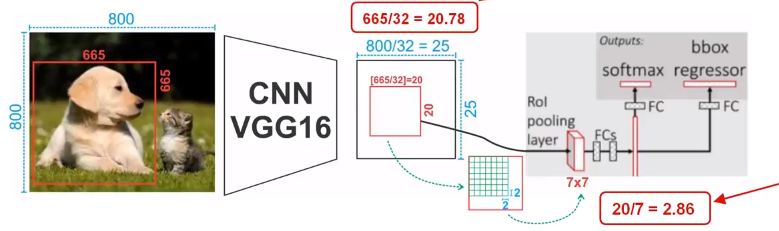
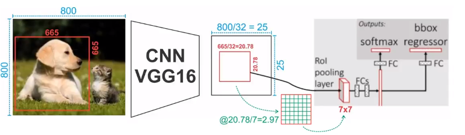
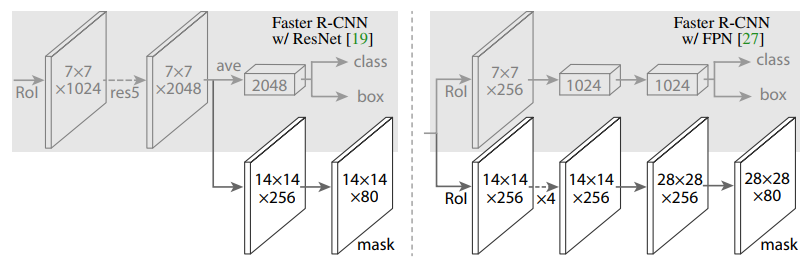
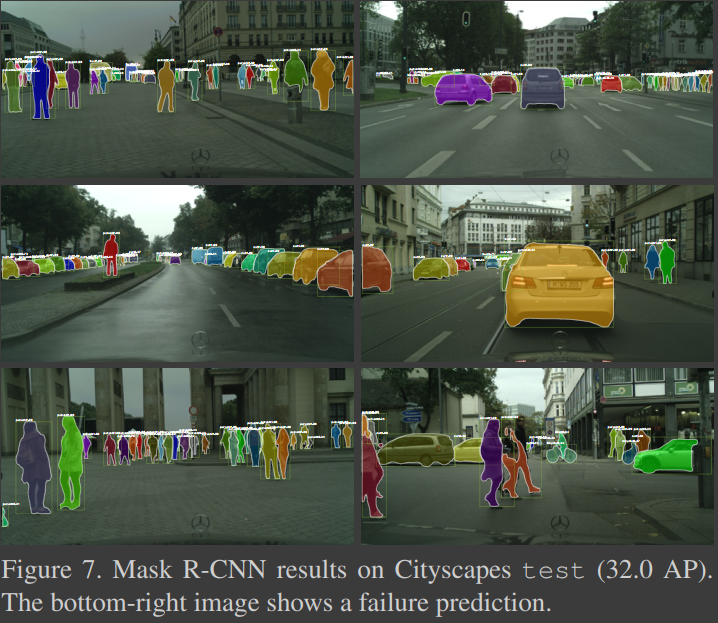
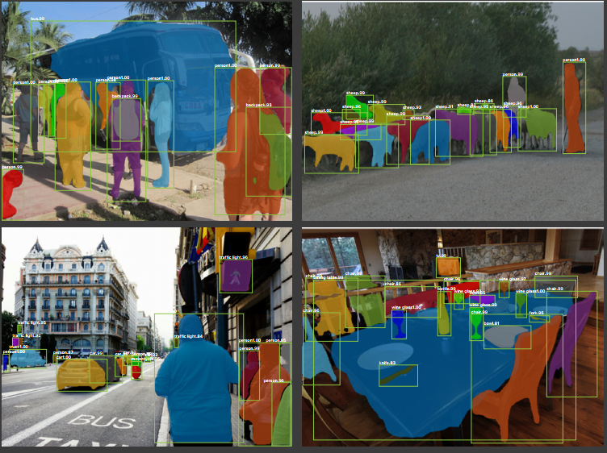

# Mask R-CNN

### Introduction
Mask R-CNN은 현재 Two-Stage Detector 모델계의 State-of-the-art 모델입니다. 이 모델 덕분에 Instance Segmentation이라는 Detection의 새로운 분야가 개척된 만큼, 많은 관심을 받았던 논문입니다.

이 논문의 목적은 Object Instance Segmentation을 위한 간단하고 유연한 프레임워크를 만드는 것이었다고 합니다. Instance Segmentaion은 입력 이미지 내에서 각 Object를 찾아냄과 동시에 높은 퀄리티의 Segmentation Mask를 씌워주는 작업을 의미합니다. 이것의 구현을 위해서, Faster R-CNN에 원래 있던 Bounding Box Regressor와 병렬적으로 돌아가는 Object Mask Predictor를 붙이겠다는 아이디어를 떠올렸습니다. 그리고 논문의 구현에 따르면, 이 모델은 Faster R-CNN에 가볍게 추가적으로 작은 모델을 붙이는 모양으로 만들 수 있고, 추가적인 Overhead도 거의 없이 Faster R-CNN의 5fps대 속도와 성능을 유지한다고 합니다. 또 Mask R-CNN을 이용하면, Segmentation이 수행되는 특징을 응용해서 사람의 신체 포즈를 잡아내는 등의 다양한 활용이 가능하다고 합니다. 또 이 모델은, COCO의 모든 Task (Instance Segmentation, Bounding-Box Object Detection, Person Keypoint Detection)에서 최고의 결과를 보여주었습니다.

### Mask R-CNN
Mask R-CNN의 네트워크 구조는 간단합니다. 기존 Faster R-CNN 모델에서, 각 RoI에 대해 Segmentation Mask를 추측하는 네트워크 구조(branch)를 Bounding Box를 예측하는 구조와 병렬적으로 동시에 돌아가도록 추가한 것입니다. 여기서 Mask branch는 작은 FCN(Fully Convolutional Network) 네트워크로, 픽셀 단위로 Segmentation을 수행합니다.

Faster R-CNN의 구조가 확장이 용이하도록 유연하게 구성되어 있기 때문에, 별다른 Computational Cost의 증가 없이 모델을 구현할 수 있었다고 합니다. 하지만 기존 모델에서 추가적으로 Masking을 구현하다 보니 문제도 있었습니다. Faster R-CNN은 네트워크의 Input과 Output간에 픽셀 단위의 조정이 필요 없었습니다. Bounding Box를 찾고 Classification을 하면 그만이었기 때문입니다. RoI Pooling의 방법만 봐도 그러한데, 이는 특징을 추출하는 과정에서 양자화(quantization)을 일으킵니다. 그래서 양자화를 방지할 수 있는 방법인 __RoiAlign__ 을 고안해서 적용하였다고 합니다.

여기서 __RoIAlign__ 에 대해 알아보고 가겠습니다.

기존 Faster R-CNN에서 RoI pooling은 각 RoI에서 7 x 7과 같은 작은 크기의 Feature Map을 추출하기 위해 사용됩니다. Backbone Network를 거치면서 입력 이미지에 대한 Feature Map의 사이즈도 줄어들었기 때문에, RoI의 크기는 보통 소숫점이 붙은 Floating Number가 되어 있습니다. 그걸 정수화해서 RoI를 다시 만드는 과정에서 quantization이 일어나게 됩니다. 실수를 정수로 바꾸는 과정에서 픽셀 단위의 정확한 정보가 무시되는겁니다. 그 RoI는 또 여러 개의 bin으로 나누어져서 Max Pooling 등의 방법으로 값들을 모으는데, 이 과정에서 quantization이 또 한번 구현됩니다. 예를 들어 20 x 20 크기의 RoI에서 7 x 7 크기의 Feature Map을 생성하려고 하면, 20 / 7 = 약 2.86으로 값이 딱 떨어지지 않기 때문에 어쩔 수 없이 몇몇 픽셀들이 주변 픽셀들과 병합되는 일이 발생하게 됩니다.

예를 들어, 입력 이미지에서 특정 픽셀의 위치가 였고 Feature map의 Stride가 16, 즉 크기가 입력 이미지의 1/16으로 줄어들었다면, RoI Pooling에서는 으로 계산했었습니다. 은 의 반올림을 의미합니다.
이런 quantization은 RoI와 추출된 Feature 사이가 맞지 않게(misalignment) 만듭니다. 조그마한 공간적 변화에 강건한(robust) 분류 문제에는 크게 상관이 없었지만, 픽셀 단위로 Mask를 예측하는 과정에서는 큰 문제를 불러왔습니다.

아래의 사진을 봅시다. 아래의 두 사진은 Youtube - Ardian Umam 님의 강의에서 가져왔습니다. [강의 영상 Youtube 링크](https://www.youtube.com/watch?v=XGi-Mz3do2s)

800 x 800 크기의 입력 이미지는 Backbone Network인 VGG를 거치면서 Stride 32의 Feature Map 출력을 내놓습니다. 그 과정에서 처음에 665 x 665 크기를 가지고 있던 RoI가 (665/32) x (665/32) 크기를 가지게 되었는데, RoI의 크기는 실수일 수 없으므로 반올림을 해서 20으로 크기를 맞추는 모습이 보입니다. 또 이렇게 만들어진 20 x 20 크기의 RoI를 7 x 7의 Feature Map으로 만드는 과정에서 각 bin마다 들어있는 픽셀의 개수가 달라지게 되고, 결론적으로 모든 픽셀의 정보를 동일하게 가지고 있을 수 없게 됩니다. 이를 quantization ‰榮鳴 부르는 것입니다.

RoIAlign은 반올림 등으로 강제로 정수개의 픽셀을 만들지 않고, bin 내의 픽셀 개수를 실수개로 놔둡니다. 그냥 RoI Pooling은 bin 내의 픽셀이 정수개였기 때문에 그냥 Max Pooling이 가능했지만 RoIAlign은 그렇지 않으므로, 각 bin 내에서 일정하게 4개의 점들을 뽑아내고 그 사이의 정확한 Input Feature에서의 값을 Bilinear Interpolation으로 구하는 작업을 거치게 됩니다. 이렇게 하면 bin 내 픽셀의 개수가 정수개가 아니더라도, 정수개처럼 Pooling을 할 수 있게 됩니다.

위의 사진은 아까와 같은 슬라이드에서 가져온 사진입니다. RoI Pooling에서 강제로 숫자들을 모두 정수로 맞춰주는 것과 달리, 여기서는 값을 실수로 계속 유지하고 있습니다. 문제가 되는 Pooling 부분은 모든 bin이 같은 갯수의 value를 가지고 연산할 수 있도록 Bilinear Interpolation으로 Feature의 value를 구하면서 모든 픽셀의 위치적 정보가 최대한 유지되도록 하고 있습니다.

이제 다시 모델의 구조로 돌아오겠습니다. 

FCN이 픽셀 단위로 Segmentation과 Classification을 동시에 수행하는 것과 달리, Mask R-CNN은 마스크 예측과 클래스 예측을 분리했습니다. 각 클래스에 대해서 독립적으로 Binary Mask를 생성하게 됩니다. FCN을 사용해 개의 마스크를 각 RoI마다 뽑아냅니다. 개의 이미지 클래스가 존재할 때,  해상도의 Binary Mask를 개 생성하는 Mask Branch의 출력 차원 수는  입니다.

또, 각 RoI에 대해서 Multi-task Loss를 사용하였습니다. 식은 아래와 같습니다.

Classification Loss인 와 Bounding Box Loss인 는 Fast R-CNN에서와 동일하게 구현됩니다.

픽셀단위 Sigmoid를 적용하기 위해서, Mask Prediction Loss인 는 픽셀 단위 Binary Cross-entropy Loss의 평균으로 이루어집니다. 해당 RoI의 Ground-truth 클래스가 번째 클래스라면, 는 번째 마스크에서만 정의되고, 나머지 마스크 출력들은 Loss에 영향을 미치지 않습니다.
의 이런 디자인은 클래스에 상관없이 모든 마스크를 생성할 수 있게 만들어줍니다. Classification Branch는 출력 마스크를 선택하기 위해 클래스를 예측하는 용도로 사용됩니다. Mask R-CNN에서는 이렇게 Mask와 Class의 Prediction을 분리했습니다.

### Model Structure / Training
Backbone Network로는 ResNet-FPN을 사용한다고 합니다. ResNet 구조를 통과한 후에 Feature를 FPN 구조에서 추출한다고 보면 될 것 같습니다. Mask R-CNN의 네트워크 구조를 보면 아래와 같이, 기존 Faster R-CNN에서 Mask를 Prediction하는 Branch가 FCN 구조로 추가되어 있는 모습을 보실 수 있습니다.

Masking의 Target은 Ground-truth Mask와 RoI와의 Intersection입니다. Mask Branch는 저것에 자신이 예측한 Mask를 맞추기 위해 Training합니다.

### Result
아래는 결과들 중 Cityscape 데이터셋 내부 이미지들에 대해서 Prediction을 수행한 결과입니다.

FPN 구조가 Backbone에 들어가있는 덕분에 여러 크기의 물체를 잘 감지하고, 또 Masking도 잘 하고 있는 모습을 볼 수 있습니다.

아래는 COCO 데이터셋 내의 이미지들에 대한 결과입니다.

