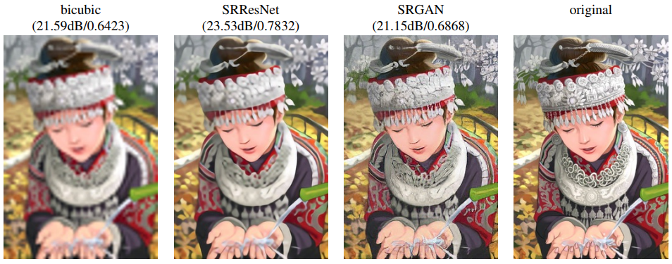
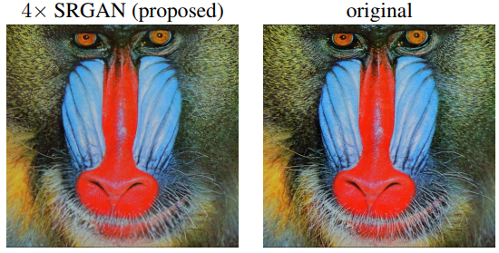
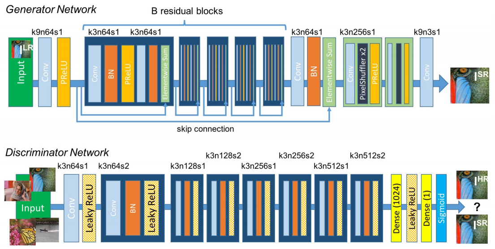
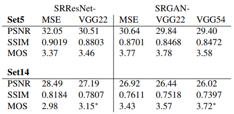
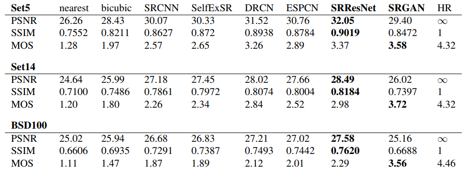

# Photo-Realistic Single Image Super-Resolution Using a Generative Adversarial Network

### Abstract
단일 이미지에 대한 SR(Super-Resolution) 작업은 깊은 Convolutional Neural Network를 통해 그 정확도와 속도 면에서 큰 발전을 보였습니다. 하지만 아직 그 구조에서 해결하지 못한 문제가 있었는데, 해상도를 올리는 과정에서 이미지의 자세한 특징(texture details)을 잡아내지 못하는 것이었습니다. 지금까지의 SR 모델들은 모델의 목적 함수에 전적으로 의존하여 작동했습니다. 최근에 가장 좋은 성능을 보인 모델은 원본 이미지와의 Mean Squared Error를 이용해 차이를 줄이는 방식으로 학습되었습니다. 결과 이미지는 높은 SNR을 가지지만, 고해상도의 세밀한 특징에서 부족하다는 점에서 불만족스러웠습니다. 이를 해결하기 위해 이 논문에서는 SR을 위한 GAN인 SRGAN을 제안합니다. 이 모델은 사실적인 사진의 해상도를 4배로 올릴 수 있는 최초의 모델이라고 논문은 주장합니다. 이 모델을 구현하기 위해, 논문에서는 Adversarial loss와 Content loss를 제안하였습니다. Adversarial loss는 실제 이미지와 모델이 해상도를 올린 이미지를 구분하도록 Discriminator를 학습시킵니다. 또한 Content loss는, MSE처럼 픽셀 단위로 유사도를 학습시키는 것이 아니라, 이미지의 특징적인 부분을 묘사하기 위하여 도입되었습니다. 큰 해상도의 이미지를 커버하기 위해 Deep Residual Network가 사용되었습니다.

### Introduction
지금까지의 SR 문제는 이미지의 특징적인 디테일보다는 'Upscaling' 자체에 집중하는 경향이 강했습니다. Supervised SR 알고리즘의 최적화 목적 함수는 보통 원본 이미지와 만들어낸 이미지의 MSE인 경우가 많았습니다. MSE를 최소화하면 SNR이 극대회되는 결과를 가져오므로 편리합니다. 하지만 MSE는 픽셀 단위에서 이미지를 비교하기 때문에, 고해상도에서의 디테일한 특징을 잡기가 힘들었습니다. 논문에 제시된 아래 그림에서 볼 수 있듯이, SNR이 높다고 해서 SR의 결과가 좋은 것만은 아닙니다.

모델에 의해 해상도가 향상된 사진과 원본 이미지의 특징적인 차이는, 향상된 사진이 사실적이지 않다는 것으로 해석할 수 있습니다.

이 논문에서는, SR을 위한 생성 네트워크인 SRGAN을 제안합니다. 이 네트워크는 skip-connection을 적용한 Residual Network 구조로 이루어져 있으며, 목적 함수를 단일 MSE를 사용하는 구조에서 벗어납니다. 대신 논문에서는 새로운 perceptual loss를 제안했으며, Discriminator에 사용된 VGG 네트워크의 상위 레벨 Feature에 대해 원본 이미지와 Upscaling한 이미지의 그것을 구분하기 힘들도록 학습합니다.

SR 작업에 GAN을 적용하면, GAN의 특성 상 SR을 거쳐 만든 이미지가 사실적인 이미지와 같아지도록 학습됩니다. 이 논문에서는 깊은 ResNet 구조를 이용하여 GAN 구조를 만들었습니다. 이 논문에서 주장한 3가지의 Contribution은 다음과 같습니다.
- 논문에서는 4배의 해상도 향상을 보이는 단일 이미지 SR을 위한 State-of-the-art 모델을 제안합니다. 모델은 16개의 Residual Block으로 이루어져 있고, MSE로 트레이닝됩니다.
- GAN을 기반으로 하여 Perceptual loss로 트레이닝되는 SRGAN을 제안합니다. 또한 VGG 네트워크 상의 Feature map을 이용하여 계산되는 MSE 기반 Content loss 또한 사용합니다.
- 또한 논문에서 제안한 모델이 Mean Opinion Score에서 State-of-the-art 성능을 보이는 것을 확인하였습니다. Mean Opinion Score(MOS)는 인간의 평가로 측정하는 점수로, 논문에서는 SR로 만든 고해상도 이미지의 품질을 실제 사람들에게 평가시킨 것 같습니다.

모델의 성능은 아래와 같이, 언뜻 보면 구분하기 힘든 SR 성능을 보여주고 있습니다.

### Method
논문에서 풀려고 하는 SISR(Single-Image Super-Resolution)은 낮은 해상도의 입력 이미지 의 해상도를 향상시킨 을 만드는 것을 목표로 합니다. 은 고해상도 이미지 을 Downsampling factor 을 가지고 Gaussian Filter를 적용하여 해상도를 낮추어 만들어집니다. 간단히 표현하자면, 과 이 의 사이즈를 가지는 이미지일 때, 은 의 사이즈를 가집니다.
모델의 목표는 LR 이미지를 원본 HR 이미지와 같이 Upsampling하는 Generator를 만드는 것입니다. 이를 위해 CNN 구조로 만들어진 Generator 를 구현합니다. 이 네트워크는 SR 모델의 최적화를 위한 loss인 을 사용합니다. 전체 이미지의 개수를 개라고 할 때, 트레이닝 이미지 과 그 짝 에 대해, Generator의 Optimal Parameter 는 다음과 같이 정의됩니다.

#### Adversarial network architecture
모델은 기본적인 GAN의 구조에 따라, Discriminator의 Parameter 와 Generator의 Parameter 가 다음과 같은 식을 각각 최소화하고 최대화하도록 학습합니다.

모델 와 는 일반적인 GAN과 같이 학습됩니다. 는 원본 고해상도 이미지와 SR로 만들어낸 이미지를 구분하기 위해 학습합니다. 이론적으로 이렇게 학습하면, Generator가 원본 고해상도 이미지와 구분하기 힘든 이미지를 생성하도록 만들 수 있습니다. 

Generator G를 학습하기 위해, B개의 Residual Block을 같은 모양으로 사용합니다. 논문에서 제안한 모델은 으로, 16개의 Block이 사용됩니다. Residual Block은 3 x 3 크기 Kernel을 가지고 있는 두 개의 Convolutional Layer를 포함하고 있으며, Batch-Normalization을 적용하고 활성화 함수로는 ParametricReLU를 사용합니다. Discriminator는 LeakyReLU 활성화 함수를 사용합니다. VGG 네트워크의 구조와 같이 3 x 3의 Kernel을 사용하는 8개의 Convolutional Layer를 사용하고, Feature Map의 개수는 64부터 512까지 2의 배수로 증가합니다. 512개의 Feature Map이 Dense layer로 들어가서 sigmoid activation을 거쳐 입력이 실제 이미지인지 SR을 거친 이미지인지 판단하게 됩니다. 이 구조를 그림으로 나타내면 아래와 같이 표현됩니다.

#### Perceptual loss function
이미지의 지각적인 특징을 살리기 위한 Loss인 Perceptual Loss 의 정의는 Generator의 성능을 크게 좌지우지합니다. 보통 이 MSE를 기반으로 디자인되는 것과는 다르게, 논문에서는 이미지의 특징을 살리기 위한 Loss를 따로 디자인하였습니다. 논문에서 제안하는 Perceptual Loss는 Content loss , Generator에 대한 Adversarial Loss 를 가중치를 주고 더한 모습입니다.

먼저 Content Loss의 정의부터 체크하고 넘어가겠습니다. 기존 SR 방법에서 사용하던 Content Loss는 보통 다음과 같은 픽셀 단위 MSE Loss였습니다.

Generator가 생성한 이미지와 원본 고해상도 이미지의 픽셀 단위 차를 구하고 있습니다. 지금까지의 많은 State-of-the-art 모델들이 이 Loss를 이용해 트레이닝했습니다. 하지만 이 Loss가 가지고 있던 문제점은, SNR을 높여주는 대신 자세한 부분(High frequency)에서의 특징(Texture)을 잘 잡지 못하고, 이미지가 너무 Smoothing된다는 것이었습니다(Overly smooth textures). 이 문제를 해결하기 위해 논문에서는 Texture의 디테일을 잡을 수 있는 __VGG Loss__ 를 새로 제안했습니다. 1를 번째 컨볼루션을 거치고 Activation 함수를 거친 후, 번째 Max pooling 레이어에 입력되기 전의 Feature Map으로 놓으면, Generator가 해상도를 향상시킨 이미지 과 원본 이미지 에 대해 VGG Loss는 다음과 같이 정의됩니다.

언뜻 보면 수식이 어려워 보이지만, 별 거 없습니다. Generator가 생성한 이미지와 원본 이미지가 번째 Feature Map을 각각 통과했을 때, 그 Map에서의 픽셀 단위 차이를 구하는 것입니다. 결과 이미지가 아니라 Feature Map 상에서 구한다는 것이 핵심입니다.

다음은 Adversarial Loss입니다. 이 Loss는 Generator가 원본 이미지와 구별하기 힘든 이미지를 내놓도록 학습시킵니다. Discriminator를 속이려고 학습하면 그에 도달할 수 있습니다. 따라서 아래와 같이 정의됩니다.

은 Discriminator가 을 원본 고해상도 이미지로 착각할 확률을 의미합니다. Gradient를 더욱 학습하기 쉽게 만들기 위해서,  대신 를 최소화시키는 방향으로 학습합니다.

### Experiments
실험은 Set5, Set14, BSD100의 세 가지 데이터셋을 이용한 트레이닝으로 진행되었습니다. 모든 실험에서 4배의 Scale factor를 가지는 SR을 구현하였습니다. 픽셀 개수가 16배 차이나는 것이죠. 정확한 비교를 위해, PSNR과 SSIM measure는 이미지의 테두리 4면에서 각각 4 픽셀씩 제거하여 y 채널에서 계산하였습니다. 성능 비교를 위한 기존 모델에는 nearest neighbor, bicubic, SRCNN, SelfExSR, DRCN이 사용되었습니다.

#### Training details and parameters
네트워크의 모든 부분은 ImageNet Database 내에서 35만개의 랜덤 이미지 샘플을 추출하여 학습되었습니다. 학습은 NVIDIA Tesla M40 GPU를 사용했습니다. LR 이미지는 HR 이미지에 Downsampling factor 를 적용하여 만들었습니다. 각 Minibatch는 데이터셋 내 랜덤한 HR 이미지 16장을 96 x 96 크기로 줄여서 만들어집니다. Generator가 Fully-Convolutional Network이기 때문에 이미지 크기는 임의로 정해도 상관없습니다. LR 이미지는  구간 내로 정규화하였고, HR 이미지는 로 정규화하였습니다. VGG Loss를 MSE와 비교하기 위해 VGG Feature Map 또한 1의 factor로 정규화해줍니다. 이는 VGG Loss 에 0.006정도의 값을 곱해주는 것과 같습니다. 트레이닝은 Adam optimizer의 로 설정하여 진행되었습니다. Generator의 초기 상태를 만들기 위한 SRResNet의 트레이닝은 Learning rate 로 100만번 트레이닝되었습니다. 그 후 SRGAN의 트레이닝은 Learning rate fh 10만번 돌린 후, Learning rate 로 다시 10만번을 돌렸습니다. Generator의 Residual Block은 16개가 사용되었습니다.

#### Mean opinion score (MOS) testing
다른 여러 SR 모델들과 비교하기 위해 MOS 테스트를 진행하였습니다. 26명의 평가자가 이미지의 퀄리티를 판단해서 1부터 5까지 점수를 줍니다. 각 평가자들은 SRGAN을 포함한 11개의 모델과 원본 HR 이미지까지 한 이미지당 12개의 버전을 각각 평가하였습니다. 평가자 당 19개의 이미지의 12개 버전별 생성 이미지와 100개 이미지의 9개 버전별 생성 이미지를 합쳐 도합 1128개의 이미지를 평가하였습니다. 
평가자들은 BSD300 데이터셋을 사용하여 분류를 먼저 시험해보았습니다. 데이터셋 내의 20개 이미지의 NN (점수 1) 및 HR (점수 5)을 구분하도록 학습했습니다. 이 시험 연구에서 논문의 저자들은 평가자들의 이미지 평가와 동일한 이미지의 실제 등급 사이에 큰 차이가 없음을 발견했습니다.  평가자들은 Generator가 만든 NN 이미지를 1로, 원본 HR 이미지를 5로 매우 일관되게 평가했다고 합니다.

#### Investigation of content loss
GAN을 기반으로 한 이 논문의 네트워크에서 Content loss의 선택이 미치는 영향을 알아보았습니다. 정확히 말해, 모델의 Loss 함수 에서 을 어떻게 설정하는지에 따라 달라지는 모델의 성능을 평가하였습니다.

Content loss로 세 가지가 제시되었습니다. 첫 번째는 SRGAN-MSE(  )로, 기본적인 MSE loss입니다. 두 번째는 SRGAN-VGG22(  )로, Feature map 를 사용한 VGG Loss이고, 세 번째는 SRGAN-VGG54(  )로, Feature map 를 사용한 VGG Loss입니다. 비교 결과는 아래 표와 같았다고 합니다.

SRGAN-VGG54가 가장 높은 MOS 점수를 받았습니다. 따라서 VGG 네트워크 내의 높은 레벨 Feature Map을 사용하는 것이 Texture detail을 잡는 데에 더 효과적임을 확인할 수 있었습니다.

#### Performance of the final networks
결론적으로, 논문에서 제안한 SRResNet과 SRGAN은 현재까지의 SR 모델들에 비교해 특히 MOS에서 월등한 성능을 보임을 확인하였습니다. 아래는 기존의 방법들과 비교한 테이블입니다.

### Conclusion
논문에서는 SR을 위한 새로운 네트워크를 제안한 것도 중요하지만, SR 모델 자체의 평가 기준을 Computational Efficiency에서 Human visual system으로 옮겨온 것이 중요하다고 봅니다. 실제로 PSNR과 SSIM은 정량적인 평가 기준이기는 하지만, 인간이 느끼기에 실제 이미지와 같음을 표현할 수 있는 기준이 되지는 못합니다. 그런 점에서 SRResNet과 SRGAN 모델이 중요한 Approach였음을 주장하고 있습니다.