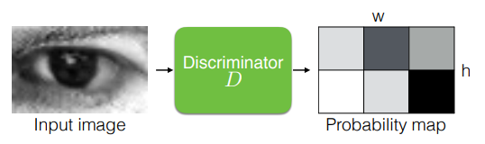
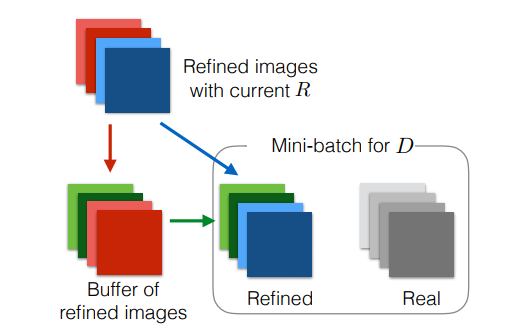
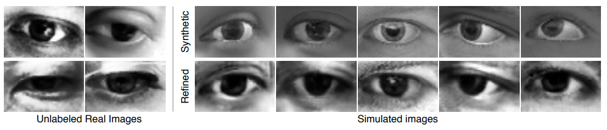

# SimGAN

원 논문 : [Learning from Simulated and Unsupervised Images through Adversarial Training](https://arxiv.org/abs/1612.07828)

### Introduction

지금까지의 많은 이미지 관련 모델들의 학습은, 추가적인 특징 정보(Annotations)가 필요 없는 정제된 이미지(Synthetic images)에 대한 학습이 주를 이루었다. 그러나, 이를 적용하고자 하는 실제 이미지(Real images)들과의 차이(gap)이 너무 커서 원하는 성능에 도달하기 힘든 문제가 있었다. 이를 해결하기 위해 논문에서는 레이블링되지 않은 Real image 데이터들을 가지고 모델이 생성하는 이미지의 현실감을 키워주는 Simulated+Unsupervised Learning(S+U Learning)을 제안한다. 이 모델은 입력으로 랜덤 노이즈 대신 정제된 이미지가 들어가는 것이 특징이다. 모델의 안정적인 트레이닝과 성능을 위해서 기존 GAN에 대비해 몇 가지 중요한 변경이 이루어졌다. 'Self-Regularization Term'을 추가하고, 'Local Adversarial Loss'를 사용하며, 과거에 정제한(refined) 이미지들을 이용해 Discriminator를 업데이트하는 것들이 그것이다.

논문에서는 SimGAN이라는 모델을 제안한다. 데이터셋의 가짜(Synthetic) 이미지가 샘플링되면, Refiner Network에서 실제 이미지에 가깝게 수정된다. Discriminator는 Refiner Network에서 나온 이미지와 레이블링되지 않은 실제 이미지를 구별하도록 학습된다. 이 과정에서 Refiner Network는 현실성있는 이미지를 만들어낼 수 있게 된다. 또, Simulator가 생성한 이미지와 Refiner가 정제한 이미지의 차이를 강제로 줄여주는 Self-Regularization Loss를 넣는다. 그리고 픽셀 단위로 연산을 수행하는 FCN 구조를 사용한다. Discriminator의 학습은 이미지 전체에 대해 하나의 Adversarial Loss를 가지지 않고, 몇 개의 Local region들으로 Receptive field를 축소하여 여러 개의 Local Adversarial Loss로 트레이닝한다. 마지막으로, Discriminator가 진동하는 상황을 방지하기 위해서, 현재 Refiner Network가 생성한 이미지 뿐만 아니라 예전에 생성했었던 이미지들을 사용해서도 Discriminator를 업데이트하는 전략을 사용했다.

모델의 구조를 그림으로 보면 다음과 같다.

### Model losses

#### Objective Loss Function (to Refiner Network)
S+U Learning의 목적은 레이블링되지 않은 real image들의 세트 를 이용해, Synthetic image 를 더 현실감있게 수정하는 Refiner 를 학습하는 것이다. 는 해당 함수의 Parameter들을 의미한다. Refiner의 출력, 즉 현실감있게 수정된 이미지는 로 정의된다. 즉 이다.

를 최대한 Real image와 맞추기 위해 Refiner를 학습시키는 Loss는 다음과 같이 두 개의 Term의 합으로 정의된다.

는 번째 트레이닝 Synthetic image를 나타낸다. 는 Synthetic image에 현실감을 더해주는 역할을 하는 Term이고, 는 현실감이 더해진 이미지에서 Synthetic image의 정보들(Annotations)을 보존하는 역할을 한다.

#### Discriminator Loss
SimGAN에서의 Discriminator는 Real image 와 Refiner를 거쳐 수정된 Synthetic image 를 구분하는 역할을 한다. 식으로 보면 다음과 같다. 따라서 이 Discriminator는 Refiner와 GAN에서와 같은 Minimax 게임을 벌인다. Loss를 수식으로 보면 다음과 같다.

는 입력이 Refiner의 출력일 확률을 반환한다. 따라서 Discriminator는 이 수식에 따라 둘을 잘 구분하도록 학습되고, Refiner는 더욱 Real image같이 Synthetic image들을 수정하려고 노력하게 된다.

Discriminator 와 Refiner 는 ConvNet으로 구현된다. 트레이닝 도중에는 Mini-batch로 Synthetic image들과 Real image들이 들어간다.

#### Refiner Loss
Realism Loss 은 Discriminator의 분류를 활용해 다음과 같은 Loss로 트레이닝된다.

앞에서 보았듯이 는 입력이 Refiner에서 나온 이미지라는 확신을 강하게 할 수록 출력값을 높게 보여준다. 따라서 위의 Loss 식은 Refiner Network의 출력이 Real image와 비슷해지게 만드는 역할을 한다. 이 식을 최소화하려면 그래야 하기 때문이다.

Refiner Network를 거치면서 Annotation들을 보존하기 위해서 사용하는 Loss인 는 L1 norm을 이용해서 다음과 같이 정의된다.

는 이미지를 픽셀 단위로 Feature space로 매핑하는 함수인데, 이 논문에서는 Identity map을 사용했다. 즉 이다. 픽셀단위 도함수, 컬러별 평균 등도 고려해봤다고 한다.

최종적으로, Refiner의 Loss는 다음과 같다. 위에서 봤던 Objective Function을 전개한 것이다.

Refiner Network는 공간적인 정보 전달이 유리한 FCN 구조를 사용했다.

### Other Strategy

#### Local Adversarial Loss

Refiner는 Discriminator를 속이려고 이미지를 생성하는 과정에서, 이미지의 특징을 과장(Over-Emphasize)시키려고 하는 경향을 가진다. 논문에서는 이를 해결하기 위해 Local Adversarial Loss를 도입했다. 원리는 간단하게 이루어져 있다. Discriminator의 출력이 이미지 하나 당 하나의 값으로 이루어지는 것이 아니라, 각 이미지에 대해서 개의 값으로 구성된 Probability map이 생성된다. 그러기 위해 Discriminator는 출력 shape를 로 만드는 FCN으로 구성된다. 이렇게 여러 개의 Adversarial Loss를 사용하면 몇 가지 이점이 있다. Receptive Field를 넓히고 많이 볼 수 있게 할 뿐만 아니라, Discriminator를 학습하기 위한 더 많은 Sample들을 제공해줄 수 있다. Refiner Network 또한 하나의 이미지에 대해 더 많은 Realism Loss를 가질 수 있으므로, 학습을 더 원활하게 진행할 수 있게 된다. Refiner Network를 학습할 때는, 각 patch에 대한 Cross-Entropy Loss들을 합산해서 사용한다.

#### Updating Discriminator using a History

또 다른 전략은, Discriminator 학습 시에 과거의 샘플들도 활용하는 방법이다. 현재 구조도 그렇고 기존 GAN들도 그랬듯이, Discriminator는 방금 Generator가 생성한 따끈따끈한 이미지에 대해서만 분류와 학습을 진행했다. 논문에서는 이 방식의 문제점이, Adversarial Training 과정에서 발산을 불러오기 쉬운데다가, Refiner Network가 Discriminator를 속이기 위해 필요 없는 특징(artifact)들을 만들어낼 수도 있다는 점이라고 주장했다. 그리고 이를 해결하기 위해서, 이전에 Refiner가 생성한 이미지들을 재활용하는 방법을 제안했다.

방법은 간단하다. 이전에 Refiner Network가 생성한 이미지들을 최대 50개까지 버퍼에 저장한다. Discriminator를 학습할 때, Mini batch의 반을 방금 Refiner가 만들어낸 이미지로 학습하고, 나머지 반은 버퍼에 저장되어 있던 예전 이미지들로 학습하는 것이다.

### Experiments

눈의 시선 방향을 캐치하기 위한 UnityEyes 데이터셋을 Synthetic image 세트로 두고, 실제 눈 이미지들이 담긴 MPIIGaze 데이터셋을 Real image 세트로 놓고 트레이닝한 결과이다. 아래쪽이 Refiner가 실제와 같이 수정한 눈 사진인데, Synthetic의 인위적인 느낌이 사라지고 Real image들과 비슷한 느낌을 가져가는 것을 볼 수 있다.

