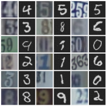

# UCDIG

### Introduction

Source domain 와 Target domain 에 대해서, 어떤 샘플 에 대한 Generator Function 가 정의될 때, 는 에서 뽑은 샘플을  도메인의 샘플으로 변환하는 작업을 한다. 이 논문의 목적은 이를 수행하는 GAN 네트워크를 만드는 것이다. 는 이든 이든 상관없이  도메인의 이미지와 구별하지 못하는 샘플을 만들도록 학습된다. 그리고 이렇게 학습되는 네트워크를 __Domain Transfer Network(DTN)__ 이라고 한다.

Source domain 에서 어떤 분포 에 따라 독립 항등 분포(i.i.d)로 샘플링된 레이블링 되지 않은 세트 가 주어지고, Target domain의 세트  또한 에서 같은 방법으로 에 따라 주어진다. 함수 가 주어지는데, 이 함수는 입력으로 어떤 도메인의 샘플이 들어오던지 도메인 로 매핑하는 함수이다. 그리고 어떤 weight인 와 metric 가 같이 주어질 때,  DTN이 최소화하고자 하는 목적 함수는 다음과 같다.

은 GAN의 목적 함수를 Domain Transfer 문제에 맞게 변형시킨 것이다. Discriminator 는 입력이 Target domain의 샘플일 때 1을 분류하도록 학습시킨다. 따라서 앞 항에서는 Source domain 에서 샘플링한 를 Discriminator에 넣었을 때, Target domain의 샘플로 인식해서 1로 분류하도록 유도하고 있다. 뒤 항은 에서 샘플링된 Target domain의 샘플을 잘 분류하도록 만드는 항이다.

는 f-constancy를 보장하는 Term이다. 함수 의 입력이 Source domain에서 나온 샘플일 떄와 Generator를 거쳤을 때, 두 경우의 차이를 최소화하려고 하고 있다. 논문에서는 metric 에 MSE를 사용하고 있다. 이 말은 곧, 가 작아질수록 함수 에 대해 와 가 같아진다는 말이 된다. 함수 는 도메인 에 대해서 정의되어있기 때문에, 이는 Source domain의 샘플과 Generator를 거친 샘플의 '의미', 즉 Context를 같다고 인식하고 있다는 뜻으로 해석할 수 있다.

### Loss function

DTN의 핵심은 다른 네트워크도 그렇듯이 Loss 함수다. 먼저 DTN에서는 Generator 를 로 보고 있다. 는 입력된 이미지에서 Context를 encode하는 함수이고, 는 그 context를 바탕으로 다시 샘플을 Generate하는 함수이다.

DTN의 Loss 함수는 Discriminator에 대한 와 Generator에 대한  둘로 이루어져 있다. 먼저 는 다음과 같이 정의된다.

는 삼중 분류를 수행하는 함수이고, 는 입력 가 클래스 에 속할 확률을 반환한다. 따라서 Loss 는 

- 샘플 로 생성한 이미지에서 가 Source domain에서 나왔는지 ()
- 샘플 로 셍성한 이미지에서 가 Target domain에서 나왔는지 ()
- 샘플 가 Target domain에서 나왔는지 ()

이 셋으로 이루어져 있다고 볼 수 있다.

다음은 Generator의 Loss 이다. 로 정의된다. 는 Weight이다.
먼저 부터 살펴보자.

식의 의미는 간단하다. 을 최소화하려면, 샘플 가 Source domain에서 샘플링됬던 Target domain에서 샘플링됬던지간에, 로부터 생성된 이미지 는 Target domain의 샘플과 비슷해야 한다. 이 이렇게 만드는 역할을 하고 있다.

다음은 다. 다음과 같이 정의된다.

함수 는 의 context를 뽑는 일을 한다고 했으므로, 저 metric 의 값이 작아질수록 생성한 이미지와 원래 샘플의 context가 같아진다는 얘기가 된다. 즉 이미지 생성이 원본과 비슷하게 잘 된다는 이야기이다. 는 그렇게 만들어주는 역할을 한다.

다음 Loss는 이고, 다음과 같이 정의된다.

Metric 는 Distance function이다. 논문에서는 MSE가 사용되었다. Target domain의 샘플과 그것으로 생성한 이미지의 차이를 줄이는 역할을 한다. 

마지막 Loss는 인데. 이미지를 부드럽게(smooth)하게 만들어주는 역할을 한다. 어떤 일인지는 [위키백과 Total Variation Denoising](https://en.wikipedia.org/wiki/Total_variation_denoising)을 참고하자. 생성한 이미지 를 이미지 내 모든 픽셀들의 집합으로 보자. 로 놓고, 다음과 같이 Loss를 정의할 수 있다.

이 Loss가 무슨 뜻이냐면, 인접한 픽셀과 너무 큰 차이가 나는 것을 줄여주는 것이다. 바로 옆 픽셀과 바로 윗 픽셀과의 차이를 줄이려고 하는 식으로 이해할 수 있다. 논문에서는 로 놓고, 제곱근을 씌우는 것과 같이 사용하고 있다.

### Model Structure

위의 아이디어와 Loss 함수를 적용한 모델의 대략적인 생김새는 아래와 같다.

### Experiments

논문에서는 SVHN과 MNIST간의 Domain transfer로 실험을 했다. MNIST를 SVHN의 이미지 사이즈인 32 x 32 x 3으로 Resize했다. Grayscale의 이미지를 3번 복사해서 Depth를 3으로 만들었다.

다음은 유명한 실험인 Face to Imoji이다. CelebA 데이터셋을 가지고 실험했는데, 시중의 프로그램을 가지고 생성한 Emoji보다 더 인물의 특징을 잘 살리는 것 같은 느낌을 준다. 문근영과 같은 익숙한 얼굴들도 있다.

