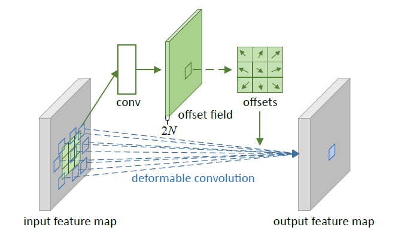
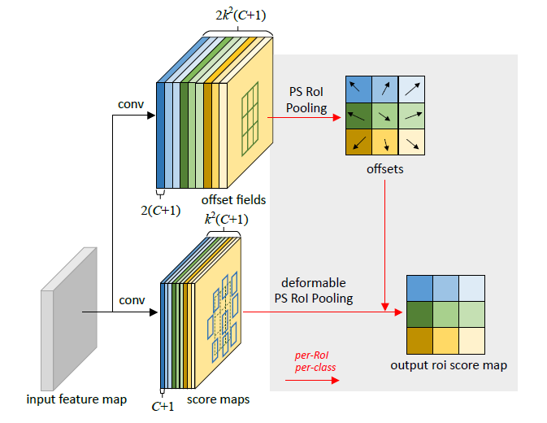
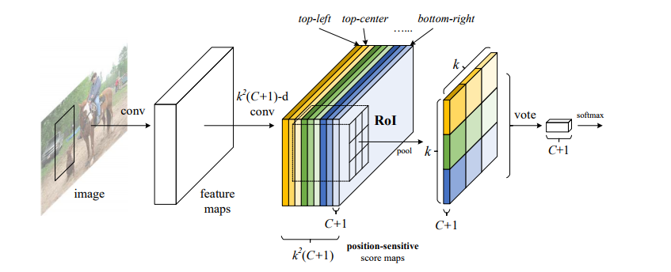

# Deformable Convolutional Network
일반적인 Convolutional Network들은, Receptive Field의 크기가 고정되어 있는 형태였습니다. 이 방식은 근본적으로 한계가 있는데, 필드의 모양과 크기가 고정되어 있으므로, Sliding Window 방식으로 Convolution을 진행할 때 이미지의 특징에 상관없이 동일한 연산을 수행한다는 것입니다.  그래서 이 논문의 저자들은, 입력 이미지의 특성에 따라서 필터의 모양을 유기적으로 변형시키는 모델을 제안했습니다.
아이디어는 간단합니다. 원래의 CNN에서 Receptive field에는 정해진 개수의 픽셀들이 입력 이미지를 커버하기 위해서 존재하는데, 이 픽셀들의 위치를 유동적으로 변경하기 위하여 Offset들을 학습하여 적용하자는 것입니다.

### Deformable Convolution

이 그림에서 전체적인 흐름을 볼 수 있습니다. 원래 필터의 각 픽셀의 위치에 따로 학습한 Offset을 적용시켜서, 각 커버 픽셀의 위치를 유동적으로 변화시킵니다. 그렇게 만들어진 다양한 모양의 필터를 통해 Convolution을 진행합니다. 이 과정에서 Input Feature Map과 같은 크기를 가지는 Offset Field를 같이 학습합니다.
먼저, 입력 Feature Map 상의 임의의 픽셀 에 대해서, 즉 상하좌우와 대각선 4방향, 현재 위치를 포함하는 9방향을 벡터로 나타냅니다.

그럼, 임의의 픽셀 를 중심으로 하는 3 x 3 Convolution 연산을 다음과 같이 정의할 수 있습니다.

이제, 각 픽셀을 일정 Offset만큼 이동시킵니다. 얼마나 이동할지는 이 다음과 같이 결정합니다.

단순하게 만큼 해당 Offset 방향으로 더 이동시키는 것입니다. 여기서 은 실수입니다. 픽셀 위치에 실수는 존재할 수 없으므로, 논문의 저자는 Offset의 적용을 쌍선형 보간법(Bilinear Interpolation)으로 수행하였습니다.

여기서 는 Feature Map 상의 모든 공간을 순회합니다.

### Deformable RoI Pooling

Roi Pooling은 각 bin의 Class 예측 Score map을 이용하는 PS RoI Pooling(Position Sensitive)를 기반으로 진행됩니다.

PS RoI Pooling은 아래 그림 한장으로 설명이 가능합니다.

임의의 RoI를 개로 나눕니다. RoI는 C+1개의 깊이를 가지고 있습니다. 개로 나누어진 RoI의 각 부분을 bin이라고 합니다. 각 bin 내의 모든 픽셀의 평균을 구해서 개의 값을 도출해내는데, 이제 9개씩 더해서 클래스 개수 개로 해당 RoI의 풀링된 대푯값들을 쌓습니다. 그럼 결과적으로 의 Length를 가지는 Score Map의 벡터가 나오는데, 이 벡터 9개(클래스 개수)를 1차원으로 펴서 SOFTMAX Classfier를 적용시켜 분류를 수행해냅니다.

수식으로 자세히 보면, 각 RoI를 개로 나눈 뒤, 개 bin들에서 각 번째 빈에 대해 다음과 같이 번째 Score map을 생성해냅니다.

이 식은, 해당 bin 내의 모든 픽셀 값들의 평균을 구해서 하나의 Score map을 출력합니다. 그리고 아래와 같이, 모든 bin에서 Score map의 합으로  차원의 벡터를 생성해냅니다.

Deformable CNN의 PS RoI Pooling에서 Offset 부분의 Convolution이 인 이유는, Offset이 x와 y좌표를 나타내는 쌍이기 때문입니다. Offset 쌍 형태인 것을 제외하고 풀링 방법은 R-FCN의 PS RoI Pooling과 동일합니다. 그리고 원래 Feature Map에서 score map을 풀링하는 과정은, Pooling을 거친 Offset 값을 사용하여 풀링의 커널 모양을 바꾼 후 진행됩니다.

트레이닝하는 과정에서, 역전파는 Offset에 대한 출력 Y의 편미분으로 변형됩니다.

### Conclusion

위의 과정을 통해서, 필터의 크기와 모양을 스스로 변형하는 CNN 모델을 구축할 수 있습니다. 이 모델이 주목받는 이유는, 데이터의 특징을 w를 통해서 찾는 것이 아니라 입력 데이터 x에서 직접 찾으려는 시도를 했다는 점입니다.
